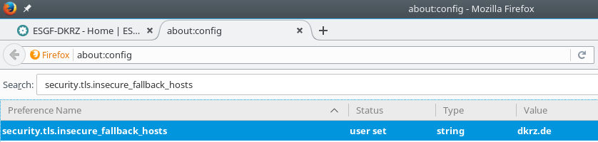
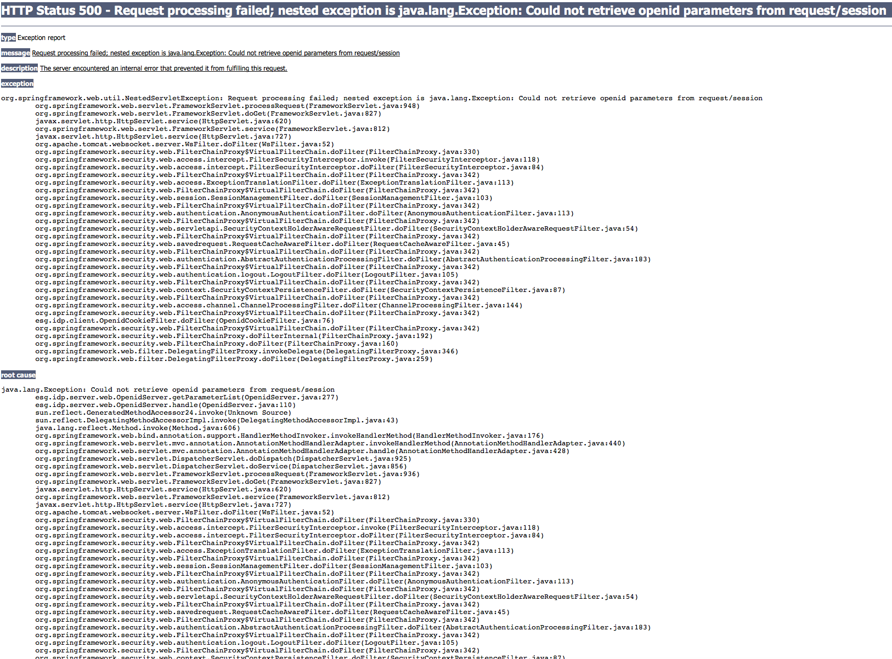
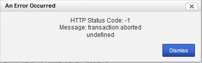

.. _faq:

FAQs
====

IMPORTANT TIPS:

+ Enable 'Show All Replicas' in the faceted search engine to increase the chances of finding a suitable node that hosts the data of your interest. 

+ Visit the `Data Nodes Status <https://esgf-node.llnl.gov/status/>`_ page to find the nodes that are down. 

This FAQ focuses on question concerning the data management and the performance of the ESGF portals and nodes. For questions regarding models performance, please contact the individual modeling centers (see just below).

How to contact the modelling group
**********************************

The contact information is in the header of the downloaded NetCDF file:

+ with netCDF4 in python: dataset_name.contact  

+ in shell: 
::

    $ ncdump -h dataset_name.nc  | grep contact

The contact of the CMIP6 modelling groups is under the "[Show citation]" button in the list of "Full Dataset Services" in the information below the result of your search.

How to contact us
******************

For questions regarding the data management and the performance of ESGF portals and nodes, 
please send an email to the user support emailing list: esgf-user@lists.llnl.gov. 

We are the data managers of several petabytes of data, in order to reproduce your issue we need the following information: 

- Your browser and operating sytem, e.g. Firefox 68.0.2 on Ubuntu 18.04.

- Your OpenID.

- The complete name of the file(s) or data set(s) you attempt to download.

- The host node, for instance, esgf-index1.ceda.ac.uk, esgf-node.llnl.gov,...

- The steps required to reproduce the problem.

- The exact error message. Run the script in debug mode to get a detailed error message: 

::

    $ bash wget-xxx.sh -H -d

If you want to meet the community and be informed of downtime notifications and updates, please subscribe to the emailing list `here <https://esgf.llnl.gov/mailing-list.html>`_.

Data
****

This FAQ focuses on questions concerning data, e.g. data format, data processing, CMIP and CORDEX data.

Each ESGF question is sorted into exactly one topic. Questions of general interest and questions matching 
several topics are under topic `ESGF General`_.

What are ensembles?
-------------------
Results of climate model runs depend on the starting point of the calculation, on the initialisation method and on the model physics.
Ensemble calculations facilitate quantifying the variability of simulation data concerning a single model. In the CMIP and CORDEX projects,
ensemble members are named in the rip-nomenclature, r for realization (starting point), i for initialization, p for physics, followed by an
integer, e.g. "r1i1p1". Find more on the data structure `here <https://verc.enes.org/data/enes-model-data/cmip5/datastructure>`_.

Do means over ensembles exist?
------------------------------
Means over several ensemble members are not in the ESGF.
You may download the individual ensemble members and calculate the mean using tools, e.g. with
`Climate Data Operators (CDO) <https://code.zmaw.de/projects/cdo/wiki/Cdo>`_.

Does an internationally common or recommended model exist?
----------------------------------------------------------
A generally recommended model doesn't exist in the CMIP and CORDEX projects. Many researchers take data from more than one model and also more
than one ensemble member per model and calculate a mean or plot them together to have a measure for the deviations of the models.

Where can I find model descriptions and associated literature?
--------------------------------------------------------------
Go to the `ES-DOC portal <http://es-doc.org/>`_.

How can I find the definition of a variable?
--------------------------------------------
CMIP and CORDEX variables obey the CF standard incl. the `CF Standard Name Table <http://cfconventions.org/Data/cf-standard-names/40/build/cf-standard-name-table.html>`_
(CF for "Climate and Forecast"). In this table is also a definition of the variable. Additional information is in the variable requirement tables of the projects, see next question.

What is the relation between Variable, CF Standard Name and Variable Long Name?
-------------------------------------------------------------------------------
The search category Variable only contains abbreviations. The CF Standard Name obeys the `CF Standard Name Table <http://cfconventions.org/Data/cf-standard-names/40/build/cf-standard-name-table.html>`_
(CF for "Climate and Forecast"). 

+ For CMIP5 variables, the relation between all three, Variable, CF Standard Name and Variable Long Name, is tabulated in the `CMIP5 Overview page <https://pcmdi.llnl.gov/mips/cmip5/index.html>`_, in the Output Requirements section under `Standard output <https://pcmdi.llnl.gov/mips/cmip5/docs/standard_output.pdf?id=73>`_.

+ For CORDEX variables see the `CORDEX Variables Requirement Table <http://is-enes-data.github.io/CORDEX_variables_requirement_table.pdf>`_. 

+ For CMIP6 variables see here: `CMIP6 variable name <http://clipc-services.ceda.ac.uk/dreq/mipVars.html>`_, `CMIP6 variable frequency <http://clipc-services.ceda.ac.uk/dreq/index/miptable.html>`_, and `CMIP6 Excel table <https://pcmdi.llnl.gov/CMIP6/Guide/dataUsers.html>`_.

Where can I find CMIP scenarios?
---------------------------------
In the CMIP5 project, Near-Term (10-30 years) or Long-Term (century and longer) climate simulations have been performed by many models.
Some of the decadal experiments are Near Term future scenarios. CMIP5 Long Term scenarios are the Representative Concentration Pathways (RCPs),
which represent the full bandwidth of future emission trajectories for the years 2006-2100, some continued until 2300.
Find more information on `here <https://verc.enes.org/data/enes-model-data/cmip5/datastructure>`_.

CMIP6 does not have experiments based on the RCP that were used for CMIP5, because scenarios are based on the Shared Socioeconomic Pathways
(SSP) instead (see "ssp..." under the Experiment ID). The reference paper is `The Scenario Model Intercomparison Project (ScenarioMIP) for CMIP6 <https://www.geosci-model-dev.net/9/3461/2016/gmd-9-3461-2016.html>`_ as part of the `CMIP6 Special Issue <https://www.geosci-model-dev.net/special_issue590.html>`_ “Coupled Model Intercomparison Project Phase 6 (CMIP6) Experimental Design and Organization”.

Where are CMIP5 historicalAA data?
----------------------------------
CMIP5 historicalAA, historical data with anthropogenic aerosol forcing only, can be found in the historicalMisc experiment.
Select historicalMisc and look for "Forcing = AA" in the metadata of the search results.

An overview which CMIP5 data for historicalAA and other forcings should exist can be found in the
`tables of Gavin Schmidt <https://pcmdi.llnl.gov/mips/cmip5/historical_Misc_forcing.pdf>`_, for CCSM and CESM models see the updated
`table of Gary Strand <http://www.cgd.ucar.edu/ccr/strandwg/SingleForcings_20C.html>`_.

Where are CMIP5 historicalSl data?
----------------------------------
CMIP5 historicalSl, historical data with solar forcing only, can be found in the historicalMisc experiment.
Select historicalMisc and look for "Forcing = Sl" in the metadata of the search results.

An overview which CMIP5 data for historicalSl and other forcings should exist can be found in the
`tables of Gavin Schmidt <https://pcmdi.llnl.gov/mips/cmip5/historical_Misc_forcing.pdf>`_.

Where can I find AR5 data?
--------------------------
Climate model output used in the IPCC's Fifth Assessment Report (AR5) is a subset of CMIP5 data. Two snapshots of these data were taken for documentation.
Both are based on the status of CMIP5 data on March 15, 2013, the cutoff date for literature to be included in the
`Working Group I report CLIMATE CHANGE 2013, The Physical Science Basis <http://www.ipcc.ch/report/ar5/wg1/>`_.
Data updates since March 15, 2013, are not included in the snapshots. A more detailed description inclusive links to access points to the two snapshots can be
found on the `AR5 GCM data page <http://www.ipcc-data.org/sim/gcm_monthly/AR5/index.html>`_ of Data Distribution Centre (DDC).

Unless you really need the frozen data with deadline March 15, 2013, we recommend CMIP5 data because erroneous CMIP5 data have usually been corrected by
publication of a new version. CMIP5 data can be downloaded from ESGF.

Where are the SRES scenarios A1B, A2 and B1?
--------------------------------------------
The SRES scenarios (`Special Report on Emission Scenarios <http://sedac.ipcc-data.org/ddc/sres/index.html>`_, for the Third Assessment Report)
belong to CMIP3. CMIP3 data are in the ESGF now. In ESGF search, select project=CMIP3 and, for example, experiment=sresa1b.

Where can I find more CORDEX 3-hourly or 6-hourly data?
-------------------------------------------------------
CORDEX 3hr and 6hr data are usually not in the ESGF but locally stored at the modelling centers according to the
`CORDEX Archive Design <http://is-enes-data.github.io/cordex_archive_specifications.pdf>`_. Please contact the modeling groups. Find the supplied contact information in the header of the downloaded NetCDF file:

+ with netCDF4 in python: dataset_name.contact  

+ in shell: ncdump -h dataset_name.nc  | grep contact

or write to the CORDEX user support mailing list datasupport@cordex.org.

Where are CORDEX regional climate models described?
---------------------------------------------------
A central database with descriptions of CORDEX regional climate models does not exist. Nevertheless, every CORDEX data file has a
header with a global attribute "references", which usually contains a web address. You may see this and other attributes without a file download:
Simply select a CORDEX file in an ESGF portal, follow the OPENDAP link and search the section "Global Attributes". Write to the CORDEX user support mailing list datasupport@cordex.org for further information.

Where can I find the land sea mask or landfrac?
-----------------------------------------------
 "landfrac" is not a variable name in ESGF. Please look for variable "sftlf", standard name "land_area_fraction".
 This is the land sea mask of the model in the projects CMIP5, CORDEX, GeoMIP, LUCID, PMIP3, ...

Which grid resolutions do CMIP5 models have?
--------------------------------------------
The following table lists the grid resolutions, i.e. the distance between adjacent grid points in degrees.

+-----------------+----------+-----------+----------------+-----------------------------------------+
| Model           |  Atmospheric Grid    |  Ocean Grid                                              |
+                 +----------+-----------+----------------+-----------------------------------------+
|                 | Latitude | Longitude | Latitude       | Longitude                               |
+=================+==========+===========+================+=========================================+
| ACCESS1.0       | 1.25     | 1.875     | lat(i,j)       | lon(i,j)                                |
+-----------------+----------+-----------+----------------+-----------------------------------------+
| ACCESS1.3       | 1.25     | 1.875     | lat(i,j)       | lon(i,j)                                |
+-----------------+----------+-----------+----------------+-----------------------------------------+
| BCC-CSM1.1      | 2.7906   | 2.8125    | 0.3333, 1      | 1                                       |
+-----------------+----------+-----------+----------------+-----------------------------------------+
| BCC-CSM1.1(m)   | 2.7906   | 2.8125    | 0.3333, 1      | 1                                       |
+-----------------+----------+-----------+----------------+-----------------------------------------+
| BNU-ESM         | 2.7906   | 2.8125    | 0.3344, 1      | 1                                       |
+-----------------+----------+-----------+----------------+-----------------------------------------+
| CCSM4           | 0.9424   | 1.25      | lat(i,j)       | lon(i,j)                                |
+-----------------+----------+-----------+----------------+-----------------------------------------+
| CESM1(BGC)      | 0.9424   | 1.25      | lat(i,j)       | lon(i,j)                                |
+-----------------+----------+-----------+----------------+-----------------------------------------+
| CESM1(CAM5)     | 0.9424   | 1.25      | lat(i,j)       | lon(i,j)                                |
+-----------------+----------+-----------+----------------+-----------------------------------------+
| CESM1(FASTCHEM) | 0.9424   | 1.25      | only time-independent ocean data                         |
+-----------------+----------+-----------+----------------+-----------------------------------------+
| CESM1(WACCM)    | 1.8848   | 2.5       | lat(i,j)       | lon(i,j)                                |
+-----------------+----------+-----------+----------------+-----------------------------------------+
| CFSv2-2011      | 1        | 1         | 0.5            | 0.5                                     |
+-----------------+----------+-----------+----------------+-----------------------------------------+
| CMCC-CESM       | 3.4431   | 3.75      | lat(i,j)       | lon(i,j)                                |
+-----------------+----------+-----------+----------------+-----------------------------------------+
| CMCC-CM         | 0.7484   | 0.75      | lat(i,j)       | lon(i,j)                                |
+-----------------+----------+-----------+----------------+-----------------------------------------+
| CMCC-CMS        | 3.7111   | 3.75      | lat(i,j)       | lon(i,j)                                |
+-----------------+----------+-----------+----------------+-----------------------------------------+
| CNRM-CM5        | 1.4008   | 1.40625   | lat(i,j)       | lon(i,j)                                |
+-----------------+----------+-----------+----------------+-----------------------------------------+
| CNRM-CM5-2      | 1.4008   | 1.40625   | lat(i,j)       | lon(i,j)                                |
+-----------------+----------+-----------+----------------+-----------------------------------------+
| CSIRO-Mk3.6.0   | 1.8653   | 1.875     | 0.9327, 0.9457 | 1.875                                   |
+-----------------+----------+-----------+----------------+-----------------------------------------+
| CSIRO-Mk3L-1-2  | 3.1857   | 5.625     | only time-independent ocean data                         |
+-----------------+----------+-----------+----------------+-----------------------------------------+
| CanAM4          | 2.7906   | 2.8125    | no ocean data                                            |
+-----------------+----------+-----------+----------------+-----------------------------------------+
| CanCM4          | 2.7906   | 2.8125    | 0.9303, 1.1407 | 1.40625                                 |
+-----------------+----------+-----------+----------------+-----------------------------------------+
| CanESM2         | 2.7906   | 2.8125    | 0.9303, 1.1407 | 1.40625                                 |
+-----------------+----------+-----------+----------------+-----------------------------------------+
| EC-EARTH        | 1.1215   | 1.125     | lat(i,j)       | lon(i,j)                                |
+-----------------+----------+-----------+----------------+-----------------------------------------+
| FGOALS-g2       | 2.7906   | 2.8125    | 0.5, 1         | 1                                       |
+-----------------+----------+-----------+----------------+-----------------------------------------+
| FGOALS-gl       | 4.1026   | 5         | 1              | 1                                       |
+-----------------+----------+-----------+----------------+-----------------------------------------+
| FGOALS-s2       | 1.6590   | 2.8125    | 0.5, 1         | 1                                       |
+-----------------+----------+-----------+----------------+-----------------------------------------+
| GEOS-5          | 2        | 2.5       | 1              | 1                                       |
+-----------------+----------+-----------+----------------+-----------------------------------------+
| GFDL-CM2.1      | 2.0225   | 2.5       | 0.3344, 1      | 1                                       |
+-----------------+----------+-----------+----------------+-----------------------------------------+
| GFDL-CM3        | 2        | 2.5       | 0.3344, 1      | 1                                       |
+-----------------+----------+-----------+----------------+-----------------------------------------+
| GFDL-ESM2G      | 2.0225   | 2         | 0.375, 0.5     | 1                                       |
+-----------------+----------+-----------+----------------+-----------------------------------------+
| GFDL-ESM2M      | 2.0225   | 2.5       | 0.3344, 1      | 1                                       |
+-----------------+----------+-----------+----------------+-----------------------------------------+
| GISS-E2-H       | 2        | 2.5       | 1              | 1                                       |
+-----------------+----------+-----------+----------------+-----------------------------------------+
| GISS-E2-H-CC    | 2        | 2.5       | 1              | 1                                       |
+-----------------+----------+-----------+----------------+-----------------------------------------+
| GISS-E2-R       | 2        | 2.5       | 1              | 1.25                                    |
+-----------------+----------+-----------+----------------+-----------------------------------------+
| GISS-E2-R-CC    | 2        | 2.5       | 1              | 1.25                                    |
+-----------------+----------+-----------+----------------+-----------------------------------------+
| HadCM3          | 2.5      | 3.75      | 1.25           | 1.25                                    |
+-----------------+----------+-----------+----------------+-----------------------------------------+
| HadGEM2-A       | 1.25     | 1.875     | no ocean data                                            |
+-----------------+----------+-----------+----------------+-----------------------------------------+
| HadGEM2-AO      | 1.25     | 1.875     | 0.3396, 1      | 1                                       |
+-----------------+----------+-----------+----------------+-----------------------------------------+
| HadGEM2-CC      | 1.25     | 1.875     | 0.3396, 1      | 1                                       |
+-----------------+----------+-----------+----------------+-----------------------------------------+
| HadGEM2-ES      | 1.25     | 1.875     | 0.3396, 1      | 1                                       |
+-----------------+----------+-----------+----------------+-----------------------------------------+
| INM-CM4         | 1.5      | 2         | 0.5            | 1                                       |
+-----------------+----------+-----------+----------------+-----------------------------------------+
| IPSL-CM5A-LR    | 1.8947   | 3.75      | lat(i,j)       | lon(i,j)                                |
+-----------------+----------+-----------+----------------+-----------------------------------------+
| IPSL-CM5A-MR    | 1.2676   | 2.5       | lat(i,j)       | lon(i,j)                                |
+-----------------+----------+-----------+----------------+-----------------------------------------+
| IPSL-CM5B-LR    | 1.8947   | 3.75      | lat(i,j)       | lon(i,j)                                |
+-----------------+----------+-----------+----------------+-----------------------------------------+
| MIROC-ESM       | 2.7906   | 2.8125    | 0.5582, 1.7111 | 1.40625                                 |
+-----------------+----------+-----------+----------------+-----------------------------------------+
| MIROC-ESM-CHEM  | 2.7906   | 2.8125    | 0.5582, 1.7111 | 1.40625                                 |
+-----------------+----------+-----------+----------------+-----------------------------------------+
| MIROC4h         | 0.5616   | 0.5625    | 0.1875         | 0.28125                                 |
+-----------------+----------+-----------+----------------+-----------------------------------------+
| MIROC5          | 1.4008   | 1.40625   | 0.5, 0.5       | 1.40625                                 |
+-----------------+----------+-----------+----------------+-----------------------------------------+
| MPI-ESM-LR      | 1.8653   | 1.875     | orthogonal curvilinear coordinates lat(i,j) and lon(i,j) |
+-----------------+----------+-----------+----------------+-----------------------------------------+
| MPI-ESM-MR      | 1.8653   | 1.875     | orthogonal curvilinear coordinates lat(i,j) and lon(i,j) |
+-----------------+----------+-----------+----------------+-----------------------------------------+
| MPI-ESM-P       | 1.8653   | 1.875     | orthogonal curvilinear coordinates lat(i,j) and lon(i,j) |
+-----------------+----------+-----------+----------------+-----------------------------------------+
| MRI-AGCM3-2H    | 0.562    | 0.5625    | no ocean data                                            |
+-----------------+----------+-----------+----------------+-----------------------------------------+
| MRI-AGCM3-2S    | 0.188    | 0.1875    | no ocean data                                            |
+-----------------+----------+-----------+----------------+-----------------------------------------+
| MRI-CGCM3       | 1.12148  | 1.125     | 0.5, 0.5       |                                         |
+-----------------+----------+-----------+----------------+-----------------------------------------+
| MRI-ESM1        | 1.12148  | 1.125     | 0.5, 1.125     | 1                                       |
+-----------------+----------+-----------+----------------+-----------------------------------------+
| NorESM1-M       | 1.8947   | 2.5       | lat(i,j)       | lon(i,j)                                |
+-----------------+----------+-----------+----------------+-----------------------------------------+
| NorESM1-ME      | 1.8947   | 2.5       | lat(i,j)       | lon(i,j)                                |
+-----------------+----------+-----------+----------------+-----------------------------------------+

 In case of the atmospheric grid and its latitude, the tabulated resolution is only valid for the equator region.
 For higher latitudes deviations may occur.

Ocean models have their own, finer grid. If two values are given for the latitude resolution of the ocean grid, the resolution is not constant.
The first value is that for the equator, the second for the poles (maximum for the two poles if different).
In case of rotated poles the resolutions for the rotated coordinates rlon and rlat are tabulated. If latitude and longitude are defined with two indices i and j,
the resolution cannot simply be read out. In this case lat(i,j) and lon(i,j) have been entered.

How can the MPI-M ocean grid be remapped?
-----------------------------------------
MPI-M ocean data are upside down, due to the MPI-M history to store the data from North to South (positive to negative latitude values). Additionally, a curvilinear grid with the North Pole over Greenland is used.

**Solution:** Use Climate Data Operator remapbil:

::

    $ cdo remapbil,r240x220 inputfile.nc outputfile.nc

More details in the `CDO documentation <https://code.zmaw.de/projects/cdo/embedded/index.html>`_.

Do all CMIP5 models use the same calendar?
------------------------------------------

No, see the table below.

+-----------------+---------------------+---------------------------------------------------------------------------------------------------------------------------------------------------------------------+
| Model           |  Calendar           |  Experiments                                                                                                                                                        |
+=================+=====================+===========+=========================================================================================================================================================+
| ACCESS1.0       | proleptic_gregorian | all                                                                                                                                                                 |
+-----------------+---------------------+---------------------------------------------------------------------------------------------------------------------------------------------------------------------+
| ACCESS1.3       | proleptic_gregorian | all                                                                                                                                                                 |
+-----------------+---------------------+---------------------------------------------------------------------------------------------------------------------------------------------------------------------+
| BCC-CSM1.1      | 365_day             | all                                                                                                                                                                 |
+-----------------+---------------------+---------------------------------------------------------------------------------------------------------------------------------------------------------------------+
| BCC-CSM1.1(m)   | 365_day             | all                                                                                                                                                                 |
+-----------------+---------------------+---------------------------------------------------------------------------------------------------------------------------------------------------------------------+
| BNU-ESM         | 365_day             | all                                                                                                                                                                 |
+-----------------+---------------------+---------------------------------------------------------------------------------------------------------------------------------------------------------------------+
| CanAM4          | 365_day             | all                                                                                                                                                                 |
+-----------------+---------------------+---------------------------------------------------------------------------------------------------------------------------------------------------------------------+
| CanCM4          | 365_day             | all                                                                                                                                                                 |
+-----------------+---------------------+---------------------------------------------------------------------------------------------------------------------------------------------------------------------+
| CanESM2         | 365_day             | all                                                                                                                                                                 |
+-----------------+---------------------+---------------------------------------------------------------------------------------------------------------------------------------------------------------------+
| CCSM4           | 365_day             | all                                                                                                                                                                 |
+-----------------+---------------------+---------------------------------------------------------------------------------------------------------------------------------------------------------------------+
| CESM1(BGC)      | 365_day             | all                                                                                                                                                                 |
+-----------------+---------------------+---------------------------------------------------------------------------------------------------------------------------------------------------------------------+
| CESM1(CAM5)     | 365_day             | all                                                                                                                                                                 |
+-----------------+---------------------+---------------------------------------------------------------------------------------------------------------------------------------------------------------------+
| CESM1(FASTCHEM) | 365_day             | all                                                                                                                                                                 |
+-----------------+---------------------+---------------------------------------------------------------------------------------------------------------------------------------------------------------------+
| CESM1(WACCM)    | 365_day             | all                                                                                                                                                                 |
+-----------------+---------------------+---------------------------------------------------------------------------------------------------------------------------------------------------------------------+
| CFSv2-2011      | gregorian           | all                                                                                                                                                                 |
+-----------------+---------------------+---------------------------------------------------------------------------------------------------------------------------------------------------------------------+
| CMCC-CESM       | gregorian           | all                                                                                                                                                                 |
+-----------------+---------------------+---------------------------------------------------------------------------------------------------------------------------------------------------------------------+
| CMCC-CM         | gregorian           | all                                                                                                                                                                 |
+-----------------+---------------------+---------------------------------------------------------------------------------------------------------------------------------------------------------------------+
| CMCC-CMS        | gregorian           | all                                                                                                                                                                 |
+-----------------+---------------------+---------------------------------------------------------------------------------------------------------------------------------------------------------------------+
| CNRM-CM5        | gregorian           | all                                                                                                                                                                 |
+-----------------+---------------------+---------------------------------------------------------------------------------------------------------------------------------------------------------------------+
| CNRM-CM5-2      | gregorian           | all                                                                                                                                                                 |
+-----------------+---------------------+---------------------------------------------------------------------------------------------------------------------------------------------------------------------+
| CSIRO-Mk3.6.0   | 365_day             | all                                                                                                                                                                 |
+-----------------+---------------------+---------------------------------------------------------------------------------------------------------------------------------------------------------------------+
| CSIRO-Mk3L-1-2  | 365_day             | all                                                                                                                                                                 |
+-----------------+---------------------+---------------------------------------------------------------------------------------------------------------------------------------------------------------------+
| EC-EARTH        | gregorian           | all                                                                                                                                                                 |
+-----------------+---------------------+---------------------------------------------------------------------------------------------------------------------------------------------------------------------+
| GEOS-5          | gregorian           | all                                                                                                                                                                 |
+-----------------+---------------------+---------------------------------------------------------------------------------------------------------------------------------------------------------------------+
| FGOALS-g2       | 365_day             | all                                                                                                                                                                 |
+-----------------+---------------------+---------------------------------------------------------------------------------------------------------------------------------------------------------------------+
| FGOALS-gl       | 365_day             | all                                                                                                                                                                 |
+-----------------+---------------------+---------------------------------------------------------------------------------------------------------------------------------------------------------------------+
| FGOALS-s2       | 365_day             | all                                                                                                                                                                 |
+-----------------+---------------------+---------------------------------------------------------------------------------------------------------------------------------------------------------------------+
| GFDL-CM2.1      | julian              | all                                                                                                                                                                 |
+-----------------+---------------------+---------------------------------------------------------------------------------------------------------------------------------------------------------------------+
| GFDL-CM3        | 365_day             | all but amip: julian                                                                                                                                                |
+-----------------+---------------------+---------------------------------------------------------------------------------------------------------------------------------------------------------------------+
| GFDL-ESM2G      | 365_day             | all                                                                                                                                                                 |
+-----------------+---------------------+---------------------------------------------------------------------------------------------------------------------------------------------------------------------+
| GFDL-ESM2M      | 365_day             | all                                                                                                                                                                 |
+-----------------+---------------------+---------------------------------------------------------------------------------------------------------------------------------------------------------------------+
| GISS-E2-H       | 365_day             | all                                                                                                                                                                 |
+-----------------+---------------------+---------------------------------------------------------------------------------------------------------------------------------------------------------------------+
| GISS-E2-H-CC    | 365_day             | all                                                                                                                                                                 |
+-----------------+---------------------+---------------------------------------------------------------------------------------------------------------------------------------------------------------------+
| GISS-E2-R       | 365_day             | all                                                                                                                                                                 |
+-----------------+---------------------+---------------------------------------------------------------------------------------------------------------------------------------------------------------------+
| GISS-E2-R-CC    | 365_day             | all                                                                                                                                                                 |
+-----------------+---------------------+---------------------------------------------------------------------------------------------------------------------------------------------------------------------+
| HadCM3          | 360_day             | all                                                                                                                                                                 |
+-----------------+---------------------+---------------------------------------------------------------------------------------------------------------------------------------------------------------------+
| HadGEM2-A       | 360_day             | all                                                                                                                                                                 |
+-----------------+---------------------+---------------------------------------------------------------------------------------------------------------------------------------------------------------------+
| HadGEM2-AO      | 360_day             | all                                                                                                                                                                 |
+-----------------+---------------------+---------------------------------------------------------------------------------------------------------------------------------------------------------------------+
| HadGEM2-CC      | 360_day             | all                                                                                                                                                                 |
+-----------------+---------------------+---------------------------------------------------------------------------------------------------------------------------------------------------------------------+
| HadGEM2-ES      | 360_day             | all                                                                                                                                                                 |
+-----------------+---------------------+---------------------------------------------------------------------------------------------------------------------------------------------------------------------+
| INM-CM4         | 365_day             | all                                                                                                                                                                 |
+-----------------+---------------------+---------------------------------------------------------------------------------------------------------------------------------------------------------------------+
| IPSL-CM5A-LR    | 365_day             | all but aqua4K, aqua4xCO2, aquaControl, past1000: 360_day                                                                                                           |
+-----------------+---------------------+---------------------------------------------------------------------------------------------------------------------------------------------------------------------+
| IPSL-CM5A-MR    | 365_day             | all                                                                                                                                                                 |
+-----------------+---------------------+---------------------------------------------------------------------------------------------------------------------------------------------------------------------+
| IPSL-CM5B-LR    | 365_day             | all but aquaControl: 360_day                                                                                                                                        |
+-----------------+---------------------+---------------------------------------------------------------------------------------------------------------------------------------------------------------------+
| MIROC-ESM       | proleptic_gregorian | 1pctCO2, abrupt4xCO2, past1000                                                                                                                                      |
+                 +---------------------+---------------------------------------------------------------------------------------------------------------------------------------------------------------------+
|                 | gregorian           | esmControl, esmFixClim2, esmHistorical, lgm, midHolocene, piControl, rcp26, rcp45, rcp60, rcp85, esmrcp85, historical, historicalGHG, historicalNat                 |
+-----------------+---------------------+---------------------------------------------------------------------------------------------------------------------------------------------------------------------+
| MIROC-ESM-CHEM  | gregorian           | all                                                                                                                                                                 |
+-----------------+---------------------+---------------------------------------------------------------------------------------------------------------------------------------------------------------------+
| MIROC4h         | gregorian           | all but piControl: 365_day                                                                                                                                          |
+-----------------+---------------------+---------------------------------------------------------------------------------------------------------------------------------------------------------------------+
| MIROC5          | 360_day             | aqua4K, aqua4xCO2, aquaControl                                                                                                                                      |
+                 +---------------------+---------------------------------------------------------------------------------------------------------------------------------------------------------------------+
|                 | 365_day             | 1pctCO2, abrupt4xCO2, amip, amip4K, amip4xCO2, amipFuture, historical, piControl, rcp26, rcp45, rcp60, rcp85, sstClim, sstClim4xCO2, sstClimAerosol, sstClimSulfate |
+                 +---------------------+---------------------------------------------------------------------------------------------------------------------------------------------------------------------+
|                 | gregorian           | decadals                                                                                                                                                            |
+-----------------+---------------------+---------------------------------------------------------------------------------------------------------------------------------------------------------------------+
| MPI-ESM-LR      | proleptic_gregorian | all                                                                                                                                                                 |
+-----------------+---------------------+---------------------------------------------------------------------------------------------------------------------------------------------------------------------+
| MPI-ESM-MR      | proleptic_gregorian | all                                                                                                                                                                 |
+-----------------+---------------------+---------------------------------------------------------------------------------------------------------------------------------------------------------------------+
| MPI-ESM-P       | proleptic_gregorian | all                                                                                                                                                                 |
+-----------------+---------------------+---------------------------------------------------------------------------------------------------------------------------------------------------------------------+
| MRI-AGCM3-2H    | gregorian           | all                                                                                                                                                                 |
+-----------------+---------------------+---------------------------------------------------------------------------------------------------------------------------------------------------------------------+
| MRI-AGCM3-2S    | gregorian           | all                                                                                                                                                                 |
+-----------------+---------------------+---------------------------------------------------------------------------------------------------------------------------------------------------------------------+
| MRI-CGCM3       | gregorian           | all                                                                                                                                                                 |
+-----------------+---------------------+---------------------------------------------------------------------------------------------------------------------------------------------------------------------+
| MRI-ESM1        | gregorian           | all                                                                                                                                                                 |
+-----------------+---------------------+---------------------------------------------------------------------------------------------------------------------------------------------------------------------+
| NorESM1-M       | 365_day             | all                                                                                                                                                                 |
+-----------------+---------------------+---------------------------------------------------------------------------------------------------------------------------------------------------------------------+
| NorESM1-ME      | 365_day             | all                                                                                                                                                                 |
+-----------------+---------------------+---------------------------------------------------------------------------------------------------------------------------------------------------------------------+

The values in the table have been taken from the calendar attributes of the NetCDF files. Since the calendars "standard" and "gregorian"
are identical as well as "noleap" and "365_day", only the latter are used in the table. CMIP calendars are defined in the
`CF standard <http://cfconventions.org/cf-conventions/cf-conventions.html#calendar>`_ and in the model output specifications for
`CMIP5 <https://pcmdi.llnl.gov/mips/cmip5/output_req.html#metadata>`_ and `CMIP6 <https://pcmdi.llnl.gov/CMIP6/Guide/dataUsers.html>`_.

How may I cite ESGF and CMIP data in my paper?
-----------------------------------------------

Find here the citation guidelines for `CMIP6 <https://pcmdi.llnl.gov/CMIP6/Guide/dataUsers.html#4-terms-of-use-and-citation-requirements>`_
and `CMIP5 <https://pcmdi.llnl.gov/mips/cmip5/citation.html>`_.

Find here the references for: 

+ ESGF: "The Earth System Grid Federation: An open infrastructure for access to distributed geospatial data". Future Generation Computer Systems, 36, 400-417, doi:10.1016/j.future.2013.07.002, 2014 `(article) <http://www.sciencedirect.com/science/article/pii/S0167739X13001477>`_.

+ CMIP6 "Coupled Model Intercomparison Project Phase 6 (CMIP6) Experimental Design and Organization" `(special issue) <https://www.geosci-model-dev.net/special_issue590.html>`_

+ CMIP5 `(list or articles) <https://pcmdi.llnl.gov/mips/cmip5/cmip5-references.html>`_

May CMIP5 historical and RCP data be combined to one long time series?
----------------------------------------------------------------------
Yes, if you select matching ensemble members. Look into the header of the RCP data file:
The attributes parent_experiment_id and parent_experiment_rip name the right ensemble member for combination. Find here more
`background information <https://verc.enes.org/data/enes-model-data/cmip5/datastructure>`_.

Which height levels do the data have?
-------------------------------------
**CORDEX data:** The height level is part of the short variable name. For example, ta500 is the air temperature at the 500 hPa pressure level.

**Before download with OPeNDAP:** Expand the dataset you need with "Show Files" and click on "OPENDAP". In the OPeNDAP Dataset Access Form look for lev and enable it. Click on "Get ASCII" and login. The lev array with the height levels will be listed.

**After download:** Use local software, for example ncdump, which is a command line tool belonging to
`NetCDF software <http://www.unidata.ucar.edu/software/netcdf/>`_.

::

    ncdump -c filename.nc

The option -c causes ncdump to output header and coordinate arrays.

Which heigth boundaries do CORDEX cloud layers have?
----------------------------------------------------
CORDEX offers cloud fraction variables for the following three height layers.

+---------------+---------------+----------------------+----------------------+
|               | Variable name | Lower boundary in Pa | Upper boundary in Pa |
+===============+===============+======================+======================+
| Low Clouds    | cll           | 100000               | 68000                |
+---------------+---------------+----------------------+----------------------+
| Medium Clouds | clm           | 68000                | 44000                |
+---------------+---------------+----------------------+----------------------+
| High Clouds   | clh           | 44000                | 0                    |
+---------------+---------------+----------------------+----------------------+

The height boundaries for the three layers are given as pressure levels and are defined in the
`CORDEX Archive Design document <http://is-enes-data.github.io/cordex_archive_specifications.pdf>`_.
The height boundaries of the layer are also stored in the netCDF file in the variable plev_bnds.

In which sequence are the data ordered inside a NetCDF file?
------------------------------------------------------------
The Network Common Data Format (NetCDF) is a binary data format for the exchange of scientific data and consists of a header and a data part.
The header contains beside attributes the structure of the data part. The data itself are deposited in arrays in the data part. This enables quick access.

Data variables are defined by means of coordinate variables, for example the near-surface air temperature tas is defined as a function of time, latitude and longitude.

::

    tas(time, lat, lon)

For Mathematicians: The order inside the array corresponds to the lexical order of its index set.
The index set of the data variable is the cartesian product of the index sets of the coordinate variables, for example

I :sub:`tas` = I :sub:`time` X I :sub:`lat` X I :sub:`lon`

The definition of the data variable in the file header contains the manner and sequence of the coordinate variables.

For Programmers: The first value in the tas array is the value for the first time, first lat and first lon. The second value is that for first time, first lat and second lon. Then the tas values for the other longitudes follow. If the number of longitudes is only 2, now the value for first time, second lat and first lon follows. If the number of latitudes is also 2, the first tas value for the second time appears in position 5.

::

   | 1 1 1 | 1 1 2 | 1 2 1 | 1 2 2 | 2 1 1 | ...

The values are written to the array in a nested loop. The innermost loop is lon, the outermost is time with lat in the middle.

How can I verify that the data have not been updated since I downloaded them?
-----------------------------------------------------------------------------
**Solution 1:** You may compare the version of the data. The version is part of the metadata and can be found in the ESGF portals. It is also printed in the NetCDF header.

**Solution 2:** ESGF offers a comfortable comparison using Wget scripting. Keep your Wget script after download and again run it with the -u option.

::

    $ bash wget-xxx.sh -u

This does not repeat the download but creates a new version of the download script. The old and the new script version are compared and this comparison includes the checksums in the download file lists of both scripts. A change in a file checksum is a hint for a new dataset version.

**Solution 3:** Sometimes data producers replace data without updating the version number in case of minor changes. In ESGF, this is not allowed and fortunately seldom. Ruling out these hidden changes is tedious. You may compare the checksum of your download file with that of a freshly downloaded file. Checksums may be calculated with md5sum:

::

    $ md5sum myfile.nc

How can I read or process downloaded data?
------------------------------------------
Data downloaded from ESGF are usually in NetCDF format. NetCDF is a header based binary format and can be read/processed by

* ncdump (conversion to ASCII) and ncview (simple graphics), i.e. command line tools belonging to `NetCDF software <http://www.unidata.ucar.edu/software/netcdf/>`_
* Command line tools, e.g. `Climate Data Operators (CDO) <https://code.zmaw.de/projects/cdo/wiki/Cdo>`_, `netCDF Operator (NCO) <http://nco.sourceforge.net/>`_ and `UVCDAT <http://uvcdat.llnl.gov/>`_: show, convert, split, merge, write and perform arithmetic operations on NetCDF
* Command line graphics, e.g. `NCAR Command Language (NCL) <http://ncl.ucar.edu/>`_ and `UVCDAT <http://uvcdat.llnl.gov/>`_
* Some applications, e.g. Matlab and Ferret
* Python: `netcdf4-python <https://pypi.python.org/pypi/netCDF4>`_ is a Python interface to the netCDF C library

An exception is NetCDF OPeNDAP download. Here you can get ASCII CSV, i.e. readable text (Comma Separated Values), or dodc (binary OPeNDAP data format). ASCII CSV can directly be imported, for example, into Microsoft Excel.

I cannot process downloaded data
---------------------------------
There might be several reasons and solutions for this issue:

**Solution 1:** If you have downloaded the file with your browser's download manager (following a HTTPServer link),
compare the checksum of your downloaded file with that in the metadata. In case the checksums are different,
repeat the download since the file may have been changed during download. ESGF Wget scripts perform this check automatically.

**Solution 2:** Many data, especially CORDEX data, are stored in the format `NetCDF4 <http://www.unidata.ucar.edu/software/netcdf/>`_
or compressed NetCDF4. Ensure that your local software can handle this relatively new data format.

How can I calculate a multi-year average for each month of year?
----------------------------------------------------------------
A multi-year average for each month of year can easily be calculated with CDO ymonavg. Example:

::

    # split into years
    $ cdo splityear OH_Amon_ULAQ_rcp45_r1i1p1_196001-210012.nc OH_
    # concatenate to a file containing 10 years
    $ cdo cat OH_1995.nc OH_1996.nc OH_1997.nc OH_1998.nc OH_1999.nc OH_2000.nc OH_2001.nc OH_2002.nc OH_2003.nc OH_2004.nc  OH_Amon_ULAQ_rcp45_r1i1p1_1995-2004.nc
    # calculate multi-year average for each month
    $ cdo ymonavg OH_Amon_ULAQ_rcp45_r1i1p1_1995-2004.nc OH_average_over_1195-2004_ULAQ_rcp45_r1i1p1_Jan-Dec.nc

More details are in the `CDO documentation <https://code.zmaw.de/projects/cdo/embedded/index.html>`_,

How can CORDEX data on a grid with rotated poles be rotated back?
-----------------------------------------------------------------
Some native CORDEX grids have rotated poles, for example the native European domains EUR-44 and EUR-11. They can easily be regridded (rotated back).

**Solution 1:** Use interpolated data
Interpolated data are in the domains with "i" at the end, e.g. EUR-44i. These data already have a grid which has been rotated back.

**Solution 2:** Use cf-python
cf-python uses the ESMF regridding library as its regridding engine, and currently provides first-order conservative (by default) or bilinear spherical regridding. CORDEX data are usually NetCDF/CF compliant; so cf-python only needs the following commands:

The rotated_fields may have more dimensions than just rotated latitude (X) and rotated longitude (Y). The above command will regrid each X-Y slice and so regridded_fields will have the same rank as the original.

::

    import cf
    rotated_fields = cf.read('rotated_pole_file.nc')
    unrotated_field = cf.read('unrotated_latlon_file.nc')
    regridded_fields = rotated_fields.regrids(unrotated_field)

More details in the `cf-python documentation <https://cfpython.bitbucket.io/docs/latest/field_manipulation.html#regridding-operations>`_

**Solution 3:** Use CDO
Climate Data Operators (CDO) offer `different ways of regridding <https://code.zmaw.de/boards/2/topics/1283>`_,
for example cdo rotuvb can perform a backward transformation of velocity components U and V from a rotated spherical system to a geographical system.
More details in the `CDO documentation <https://code.zmaw.de/projects/cdo/embedded/index.html>`_.

There seems to be missing data for some models.
-----------------------------------------------

**Solution 1:**
Some models do not provide data for all years. See the model documentation in the `ES-DOC <https://es-doc.org/>`_ documentation ecosystem.
You can also find the model output requirements for CMIP5 here: `<https://pcmdi.llnl.gov/mips/cmip5/requirements.html>`_ and
for CMIP6 here:  `<https://pcmdi.llnl.gov/CMIP6/Guide/modelers.html#4-model-output-fields>`_.

In general, questions related to the models and possibly missing data should be addressed to the modeling centers using the supplied contact information in the file header.
::

    $ ncdump -h <filename>  | grep contact

The contact of the CMIP6 modelling groups is under the “[Show citation]” button in the list of “Full Dataset Services” in the information below the result of your search.

**Solution 2:**
Look into the errata of the project, it might be a known issue. As part of the `ES-DOC <https://es-doc.org/>`_ documentation ecosystem, the ESGF Errata Service centralizes timely information about known issues of ESGF data. Please, visit the `docs <https://es-doc.github.io/esdoc-errata-client/index.html>`_ about how to look up or report an issue.

What do 'x' and 'y' refer to in the ocean variables 'hfx' and 'hfy' in CMIP5?
-----------------------------------------------------------------------------
'x' and 'y' refer to grid directions, which may vary from one grid cell to another.
This is explained in the definitions of the standard names, e.g. for ocean_heat_x_transport: 'x' indicates a vector component along the grid x-axis,
positive with increasing x.

ESGF General
************

What browsers does ESGF support?
--------------------------------
ESGF supports the following browsers. These are the browsers we test on.

* Firefox (best in a Private Window, see Firefox's main menu)
* Chrome
* Internet Explorer

**Safari Issue:** Safari has a known bug that prevents it from sending too many certificates when interacting over SSL.
This results in some ESGF sites failing to display the login page. If you encounter such a problem, please use Firefox or Chrome.

**Internet Explorer Issue:** Registration to an ESGF data access group may be slow with Internet Explorer. If you experience this, try another browser.

Shall I use my personal certificate in the browser?
---------------------------------------------------
No. If a message appears whether to use your personal credials imported into your browser, please press "Cancel".

I get the error: "Secure Connection Failed" with Firefox
--------------------------------------------------------
This error has to do with encryption and seems to depend on Firefox version, operating system and ESGF portal.

.. image:: images/secure_connection_failed.png

**Solution:** In Firefox open local page about:config and add the portal or site name to the security.tls.insecure_fallback_hosts. An example is shown in the image below.

I have a question or error to report to ESGF
--------------------------------------------
Questions and error reports related to the ESGF portals and nodes performance should be sent to esgf-user@lists.llnl.gov. 

For questions related to the models output or performance, please contact the individual modeling centers using the supplied contact information in the file header:

+ with netCDF4 in python: dataset_name.contact  

+ in shell: ncdump -h dataset_name.nc  | grep contact

As part of the `ES-DOC <https://es-doc.org/>`_ documentation ecosystem, the ESGF Errata Service centralizes timely information about known issues of ESGF data. Please, visit the `docs <https://es-doc.github.io/esdoc-errata-client/index.html>`_ about how to find or report an issue.

How can I subscribe/unsubscribe esgf-user@lists.llnl.gov?
---------------------------------------------------------
* Subscribe:
    Send a mail to: listserv@listserv.llnl.gov.
    The subject should be blank. The body should contain only the following:

    ::

        Subscribe esgf-user

* Unsubscribe:
    Send a mail to: listserv@listserv.llnl.gov.
    The subject should be blank. The body should contain only the following:

    ::

        Signoff esgf-user

ESGF Wget
*********

Is there any easy way to generate wget scripts for downloading lots of model data only during a certain period, such as 1950-2000?
-----------------------------------------------------------------------------------------------------------------------------------
Unfortunately it is not possible to generate wget scripts for a certain period. You can only filter the datasets. For the files, you would need
to remove those you don't need from the wget script. See the `Wget scripting <https://esgf.github.io/esgf-user-support/user_guide.html#wget-scripting>`_  information in the `RESTful API <https://esgf.github.io/esgf-user-support/user_guide.html#the-esgf-search-restful-api>`_ section in the tutorial.

Issues with Script Generation
-----------------------------

I get the error: "Request-URI Too Large"
^^^^^^^^^^^^^^^^^^^^^^^^^^^^^^^^^^^^^^^^
Error message:

::

    Request-URI Too Large
    The requested URL's length Exceeds the capacity limit for this server.

This is a current error on the Web DataCart. Internally, script creation is initiated by an URL containing commands. At the moment, this URL is becoming too long if the request contains a large number of datasets. A fix is announced.

* Solution 1
    Create several Wget scripts, i.e. split your big request into smaller ones. Subdivision of the request into different scripts, one for each data node, will automatically be done but in case of this error an additional subdivision by the user is necessary.

* Solution 2
    Create a text file post_data_dataset_id.txt. Copy and paste to this file the URL address which appears in your browser when you get the "Request-URI Too Large" error. From this URL remove everything until the first 'dataset_id=' text token appears (including it). Then run the following command in a Shell:

    ::

        wget --post-file post_data_dataset_id.txt "http://esgf-data.dkrz.de/esg-search/wget/?distrib=false&limit=10000" -O wget_script.sh

    If everything is ok, you will end with a wget_script.sh that you can execute to download the full collection of datasets.

General Wget Runtime Issues
---------------------------

Do I need to use my username / password?
^^^^^^^^^^^^^^^^^^^^^^^^^^^^^^^^^^^^^^^^
If you are trying to download unrestricted datasets with Wget, eg, CMIP3-6, obs4MIPs, input4MIPs, E3SM, then the answer is No: username / password are not required.  However you need to instruct the Wget script to bypass the login prompt using the option -s.  When using this method for download, ensure you are not using additional options, eg. -s and -H should never be combined

    ::

        $ bash wget-xxx.sh -s

Issues with Certificates or Java
--------------------------------

Note that these issues deal with restricted project downloads.  For unrestricted downloads see the  -s  option description above.

Error: "Unsupported major.minor version 51.0"
^^^^^^^^^^^^^^^^^^^^^^^^^^^^^^^^^^^^^^^^^^^^^
Error message:

::

    Retrieving Credentials...Exception in thread "main" java.lang.UnsupportedClassVersionError: esg/security/myproxy/MyProxyConsole :
    Unsupported major.minor version 51.0
	    at java.lang.ClassLoader.defineClass1(Native Method)
	    at java.lang.ClassLoader.defineClass(ClassLoader.java:643)
	    at java.security.SecureClassLoader.defineClass(SecureClassLoader.java:142)
	    at java.net.URLClassLoader.defineClass(URLClassLoader.java:277)
	    at java.net.URLClassLoader.access$000(URLClassLoader.java:73)
	    at java.net.URLClassLoader$1.run(URLClassLoader.java:212)
	    at java.security.AccessController.doPrivileged(Native Method)
	    at java.net.URLClassLoader.findClass(URLClassLoader.java:205)
	    at java.lang.ClassLoader.loadClass(ClassLoader.java:323)
	    at sun.misc.Launcher$AppClassLoader.loadClass(Launcher.java:294)
	    at java.lang.ClassLoader.loadClass(ClassLoader.java:268)
    Could not find the main class: esg.security.myproxy.MyProxyConsole. Program will exit.
    Certificate could not be retrieved

Two solutions are possible in case of this Java issue:

* Solution 1
    Run the wget script with the -H option.

    ::

        $ bash wget-xxx.sh -H

    Authentication will be tried without certificates then.

* Solution 2
    Install Oracle Java 1.7 or newer and add it to your environment (define JAVA_HOME etc.). The Wget script can usually be used without options then.

Error: "RSA premaster secret error"
^^^^^^^^^^^^^^^^^^^^^^^^^^^^^^^^^^^
Error message:

::

    Retrieving Credentials...RSA premaster secret error
    Use --help to display help.
    Certificate could not be retrieved

Two solutions are possible in case of this Java issue:

* Solution 1
    Run the wget script with the -H option.

    ::

        $ bash wget-xxx.sh -H

    Authentication will be tried without certificates then.

* Solution 2
    Install Oracle Java 1.7 or newer and add it to your environment (define JAVA_HOME etc.). The Wget script can usually be used without options then.

Error: "algorithm/RSA/ECB/PKCS1Padding is not available from provider Cryptix"
^^^^^^^^^^^^^^^^^^^^^^^^^^^^^^^^^^^^^^^^^^^^^^^^^^^^^^^^^^^^^^^^^^^^^^^^^^^^^^
Error message:

::

    java.security.NoSuchAlgorithmException: algorithm/RSA/ECB/PKCS1Padding is not available from provider Cryptix

Two solutions are possible in case of this Java issue:

* Solution 1
    Run the wget script with the -H option.

    ::

        $ bash wget-xxx.sh -H

    Authentication will be tried without certificates then.

* Solution 2
    Install Oracle Java 1.7 or newer and add it to your environment (define JAVA_HOME etc.). The Wget script can usually be used without options then.

Error: "GSSException"
^^^^^^^^^^^^^^^^^^^^^
Example error message:

::

    Please give your OpenID (hit ENTER to accept default)
    [https://myserver/example/username]? https://esgf-node.llnl.gov/esgf-idp/openid/.......
    MyProxy Password?
    Retrieving Credentials...
    MyProxy get failed. [Caused by: Authentication failed
    [Caused by: org.ietf.jgss.GSSException, major code: 11, minor code: 0 major string: General failure, unspecified at GSSAPI level minor string:
    None
    [Caused by: Bad certificate (java.security.SignatureException: SHA-1/RSA/PKCS#1: Not initialized)]]] Use --help to display help.
    Certificate could not be retrieved

Two solutions are possible in case of this Java issue:

* Solution 1
    Run the wget script with the -H option.

    ::

        $ bash wget-xxx.sh -H

    Authentication will be tried without certificates then.

* Solution 2
    Install Oracle Java 1.7 or newer and add it to your environment (define JAVA_HOME etc.). The Wget script can usually be used without options then.

Error: "MyProxy bootstrapTrust failed"
^^^^^^^^^^^^^^^^^^^^^^^^^^^^^^^^^^^^^^
Error message:

::

    Connecting to esgf-node.llnl.gov...
    Error: MyProxy bootstrapTrust failed. [Caused by: No appropriate protocol (protocol is disabled or cipher suites are inappropriate)]

Three solutions are possible in case of this Java issue:

* Solution 1
    Run the wget script with the -H option.

    ::

        $ bash wget-xxx.sh -H

    Authentication will be tried without certificates then.

* Solution 2
    Run the wget script with the -T option.

    ::

        $ bash wget-xxx.sh -T

    Another cryptographic protocol will be used for communication then: TLS (Transport Layer Security) instead of SSL (Secure Sockets Layer).

* Solution 3
    Install Oracle Java 1.7 or newer and add it to your environment (define JAVA_HOME etc.). The Wget script can usually be used without options then.

Error: "Received fatal alert: handshake_failure"
^^^^^^^^^^^^^^^^^^^^^^^^^^^^^^^^^^^^^^^^^^^^^^^^
Error message:

    ::

        Received fatal alert: handshake_failure

Three solutions are possible in case of this Java issue:

* Solution 1
    Run the wget script with the -T option.

    ::

        $ bash wget-xxx.sh -T

    Another cryptographic protocol will be used for communication then: TLS (Transport Layer Security) instead of SSL (Secure Sockets Layer).

* Solution 2
    Run the wget script with the -H option.

    ::

        $ bash wget-xxx.sh -H

    Authentication will be tried without certificates then.

* Solution 3
    Install Oracle Java 1.7 or newer and add it to your environment (define JAVA_HOME etc.). The Wget script can usually be used without options then.

getcert.jar cannot be retrieved
^^^^^^^^^^^^^^^^^^^^^^^^^^^^^^^
Example error message:

::

    MyProxy Password?
    Retrieving Credentials...
    Invalid or corrupt jarfile /Users/..../.esg/getcert.jar
    Certificate could not be retrieved

Further example:

::

    MyProxy Password?
    Retrieving Credentials...Error: Unable to access jarfile /home/..../.esg/getcert.jar
    Certificate could not be retrieved

* Solution 1
    Your certificates are presumably corrupted. Remove everything under the credentials directory `~/.esg` and run the Wget script again. The .esg will automatically be rebuilt when you run the next Wget script.

* Solution 2
    Run the wget script with the -H option.

    ::

        $ bash wget-xxx.sh -H

    Authentication will be tried without certificates then.

* Solution 3
    The Wget application installed on your system might not be compiled with SSL (Secure Sockets Layer). You can check this by issuing

    ::

        $ wget --help

    and investigating wether or not there are some SSL options. If not

        * Run the Wget script with the -T option. Another cryptographic protocol will be used for communication then: TLS (Transport Layer Security) instead of SSL
        * Or talk to your system administrator about installing a new version of Wget with SSL support

* Solution 4
    Try to obtain certificates from another system. Run a short download with a Wget script there. Copy the certificates from the other system onto the system, where you want to run the script, in the location ~/.esg/credentials.pem then. Maybe the easiest way is to copy the whole credentials directory .esg

* Solution 5
    If you are trying to download unrestricted datasets with Wget, eg, CMIP3-6, obs4MIPs, input4MIPs, E3SM, then the answer is No: username / password are not required.  However you need to instruct the Wget script to bypass the login prompt using the option -s.  When using this method for download, ensure you are not using additional options, eg. -s and -H should never be combined

    ::

        $ bash wget-xxx.sh -s

The Wget script does not trust the certificate of the server
^^^^^^^^^^^^^^^^^^^^^^^^^^^^^^^^^^^^^^^^^^^^^^^^^^^^^^^^^^^^
Example error message:

::

    Self-signed certificate encountered.

Further example error message:

::

    Connecting to ... connected.
    OpenSSL: error:14094416:SSL routines:SSL3_READ_BYTES:sslv3 alert certificate unknown
    Unable to establish SSL connection.
    download failed

"Certificate unknown" signals that the server does not trust the certificate issued by the MyProxy CA (Certification Authority)

* Solution 1
    Run the wget script with the -i option.

    ::

        $ bash wget-xxx.sh -i

    The server certificate will not be checked then.

* Solution 2
    Your certificates are maybe corrupted. Remove everything under the cert directory `~/.esg` and run the Wget script again. The .esg will automatically be rebuilt when you run the next Wget script.

* Solution 3
    Contact the ESGF users mailing list esgf-user@lists.llnl.gov to notify the ESGF administrators there might be a problem with the server certificate.

Error: "no CA certificates found"
^^^^^^^^^^^^^^^^^^^^^^^^^^^^^^^^^
The user's local ESGF certificates directory ~/.esg is incomplete. Example error message:

::

    java.security.cert.CertificateException: no CA certificates found in /Users/user_name/.esg/certificates
    Use --help to display help.
    Certificate could not be retrieved

* Solution
    Remove everything under `~/.esg` and run the Wget script again. The .esg will automatically be rebuilt when you run the script again.

Error: "Unknown CA"
^^^^^^^^^^^^^^^^^^^

::

    [Caused by: Authentication failed [Caused by: Failure unspecified at GSS-API level [Caused by: Unknown CA]]]

* Solution
    Remove everything under `~/.esg` and run the Wget script again. The .esg will automatically be rebuilt when you run the script again.

Error: "Unrecognized SSL message, plaintext connection?"
^^^^^^^^^^^^^^^^^^^^^^^^^^^^^^^^^^^^^^^^^^^^^^^^^^^^^^^^
This error occurs if an OpenID provider is not properly registered after the ESGF overhaul. The ESGF federation began to upgrade its servers in October 2015. Not every Node has been upgraded yet. OpenIDs issued from un-upgraded nodes, will not work. Example error message:

    ::

        MyProxy Password?
        Retrieving Credentials...Apr 05, 2016 7:15:43 PM esg.security.myproxy.CredentialConnection getCredential
        WARNING: Remote host closed connection during handshake
        Unrecognized SSL message, plaintext connection?
        Use --help to display help.
        Certificate could not be retrieved

* Solution 1
    If you have an OpenID issued by the old "hydra.fsl.noaa.gov" server, your new OpenID will contain the string "esgf.esrl.noaa.gov" instead. For example, instead of using: https://hydra.fsl.noaa.gov/esgf-idp/openid/your_username use instead: https://esgf.esrl.noaa.gov/esgf-idp/openid/your_username (or choose "NOAA/ESRL" in the openid pull down menu). Your username and password have NOT changed.

* Solution 2
    Create a new account at upgraded Nodes. You can find upgraded Nodes by using the "Federated ESGF-CoG Nodes", which should be located on the Home page of all ESGF Nodes.

    .. image:: images/federated_nodes.png

Error: "Failed to open cert"
^^^^^^^^^^^^^^^^^^^^^^^^^^^^
Example error message:

    ::

        ERROR: Failed to open cert /Users/someone/.esg/certificates/0119347c.signing_policy: (0).

The error message indicates that something is wrong with your local certificate directory. This error is usually not fatal, i.e. the script run is continued. If your script run ended prematurely, also look for messages below.

* Solution
    Remove all contents of the directory ~/.esg and try running the Wget script again. The .esg will automatically be rebuilt when you run the next Wget script.

I have a problem running MyProxyLogon application
^^^^^^^^^^^^^^^^^^^^^^^^^^^^^^^^^^^^^^^^^^^^^^^^^
MyProxyLogon application may be used to prepare a download script run (Wget script run) but this is error prone. Under Linux or Mac OS this is also outdated since Wget scripts are itself able to fetch the necessary credentials and to inquire OpenID and password.

Please try running the wget script alone. Before you try it again, remove your credentials directory .esg since your credentials may be damaged due to the MyProxyLogon failure. ESGF Wget scripts will automatically rebuild the credentials directory if it is missing.

Issues with Option -H
---------------------
An ESGF Wget script with option -H does not need locally stored certificates for user authentication but sends OpenID and password encrypted with Wget. On the one hand, use of option -H can avoid many potential error sources. On the other hand, some new errors may occur, which come without verbose respose, sometimes even without an error message. Please enable debug mode with option -d to get an error message in this case.

::

    $ bash wget-xxx.sh -H -d

Error: "Retry failed"
^^^^^^^^^^^^^^^^^^^^^
After an unsuccessful try, the script tries again to download a file, also without success.

::

    sftlf_fx_HadGEM2-ES_esmFixClim1_r0i0p0.nc ...Downloading
    Retrying....
    ERROR : Retry failed.
    download failed

One possible reason for this error is a missing membership in a data access control group. In debug mode, the script additionally throws the error message "403 Forbidden" in this case.

* Solution
    Join a matching :ref:`data access control group <data_access_groups>`_.

Server issues may also affect script runs with option -H. If you get the additional error message "Self-signed certificate encountered" when you use debug option -d, try the following.

* Solution
    Combination with the "insecure" option.

    ::

        $ bash wget-xxx.sh -H -i

    The server certificate will not be checked then.

Another possible reason may affect Windows/Cygwin users. Under Windows, user names with blanks are allowed. These user names are overtaken into Cygwin during Cygwin installation and disturbe Wget scripting.

* Solution 1
    Change your Windows user name before you install Cygwin.

* Solution 2
    Change your Cygwin user name and the name of your Cygwin home directory. By default Cygwin does not create an /etc/passwd file, where users are defined under UNIX, but it can be created with

    ::

        mkpasswd

    Create a new home directory without blank in its name and copy all important files including .bash_profile, .bashrc, .inputrc and .profile to this new directory. Adapt the last line in /etc/passwd (that defining your account) using a text editor.

Error: "HTTP request to OpenID Relying Party service failed"
^^^^^^^^^^^^^^^^^^^^^^^^^^^^^^^^^^^^^^^^^^^^^^^^^^^^^^^^^^^^
Example error message:

::

    sftgif_ARC-44_ECMWF-ERAINT_evaluation_r1i1p1_AWI-HIRHAM5_v1_fx.nc ...Downloading
    ERROR : HTTP request to OpenID Relying Party service failed.
    download failed
    done

* Before considering any of the Solutions below, ensure that the data you are trying to download is from a restricted project, meaning that a login is required, if not use the -s option (see above). When using this method for download, ensure you are not using additional options eg. -s and -H should never be combined

* Solution 1
    The user name alone is not sufficient. Enter your complete, correctly spelled OpenID behind

    ::

        Enter your openid :

* Solution 2
    OpenIDs with machine names pcmdi.llnl.gov, pcmdi9.llnl.gov or hydra.fsl.noaa.gov are outdated. Please replace the machine name by the new one, esgf-node.llnl.gov or esgf.esrl.noaa.gov, in the OpenID.

* Solution 3
    OpenIDs issued from www.earthsystemgrid.org are no longer accepted in the ESGF. Please case create a new OpenID at a running ESGF portal, for example https://esgf-data.dkrz.de/ or https://esgf-node.llnl.gov/.

* Solution 4
    Under Mac OS this error may be thrown if Wget is not installed. Please install it, see question `Error: "wget: command not found"`_.

* Solution 5
    This error may also be thrown if a node is not fully online, for example, the node is offline for maintenance.  Please wait until maintenance has been finished. Visit the `Data Nodes Status <https://esgf-node.llnl.gov/status/>`_ page to find the nodes that are down. In the mean time, please enable ‘Show All Replicas’ in the faceted search engine to increase the chances of finding a suitable node that hosts the data of your interest.

* Solution 6
    The data node is online, but the local operating system is outdated and does not recognize the data nodes's web certificate when trying to establish a secure connection via wget.  In this case, upgrade the local operating system, try a different client system.  This scenario is revealed if running the script in debug mode (-d).
    The following workaround using the -i option has shown to work when using -H:

    ::

        wget-XXXXXX -H -i

* Solution 7
    If you are trying to download unrestricted datasets with Wget, eg, CMIP3-6, obs4MIPs, input4MIPs, E3SM, then the answer is No: username / password are not required.  However you need to instruct the Wget script to bypass the login prompt using the option -s.  When using this method for download, ensure you are not using additional options, eg. -s and -H should never be combined

    ::

        $ bash wget-xxx.sh -s

In all other cases contact ESGF support esgf-user@lists.llnl.gov

Error: "HTTP request to OpenID Provider service failed"
^^^^^^^^^^^^^^^^^^^^^^^^^^^^^^^^^^^^^^^^^^^^^^^^^^^^^^
* Solution 1
    Most of the data sets are unrestricted, for instance, CMIP3-6, obs4MIPs, input4MIPs, and E3SM. However you need to instruct the Wget script to bypass the login prompt using the option -s.

    ::

        $ bash wget-xxx.sh -s

* Solution 2
    Please send an email to the user support emailing list: esgf-user@lists.llnl.gov, the certificate of the node might have expired.

Error: "401 Unauthorized"
^^^^^^^^^^^^^^^^^^^^^^^^^
Access to ESGF data is restricted for some projects. Before you can download data, you have to join a data access control group since acknowledgement of a policy is a condition for data download. If you lack a group membership and try to get data from ESGF with a Wget script and options -H -d, you will get an error message like this:

::

    HTTP request sent, awaiting response... 401 Unauthorized
    Username/Password Authentication Failed.

* Solution:
    Please join a proper :ref:`data access control group <data_access_groups>`.

How to avoid entering OpenID and password before executing a Wget script?
^^^^^^^^^^^^^^^^^^^^^^^^^^^^^^^^^^^^^^^^^^^^^^^^^^^^^^^^^^^^^^^^^^^^^^^^^
If Oracle Java, version 1.7 or newer, is locally installed and Wget scripts are run without option -H, OpenID and password are only inquired once per data node.

Network Issues
--------------

Error: "Connection timed out" or "Connection refused"
^^^^^^^^^^^^^^^^^^^^^^^^^^^^^^^^^^^^^^^^^^^^^^^^^^^^^
Example error message:

::

    Retrieving Credentials...MyProxy get failed. [Caused by: connect timed out]
    Use --help to display help.
    Certificate could not be retrieved

* Solution 1
    Please make sure that your Wget script can connect to an ESGF MyProxy server, for example on host esgf-data.dkrz.de, and port 7512. For testing you may do the following:

    ::

        echo | telnet esgf-data.dkrz.de 7512

    This is the output expected if you can connect successfully:

    ::

        Trying 136.172.50.66...
        Connected to esgf-data.dkrz.de.
        Escape character is '^]'.
        Connection closed by foreign host.

    And this is an example for an output if you cannot make the connection:

    ::

        Trying 136.172.50.66...
        telnet: connect to address 136.172.50.66: Connection refused
        telnet: Unable to connect to remote host: Connection refused

    If this is the case, you need to contact with your system administrator and tell him/her you need to access esgf-data.dkrz.de over port 7512 (TCP) (or the server and port you are trying to connect to).

* Solution 2
    ESGF data node esgf2.dkrz.de is tape-based and might be slow, dependent on the workload. The default timeout for ESGF Wget scripts is set to 15 minutes and this is not sufficient sometimes. The easiest way to handle this error is to re-run the script. This should not take too long since already downloaded files are not re-downloaded and most of the tape data should be ready in esgf2's disk cache after a request for it.

Error: "No route to host"
^^^^^^^^^^^^^^^^^^^^^^^^^
Your request could not be routed to the server. This problem can be caused at the server's or the user's site or in between. Maybe a part of the network is down.

Checksum Issues or Command not Found
------------------------------------
ESGF Wget scripts contain a SHA256 or MD5 checksum for each download file. After download, the checksum is 
again calculated on the user's local machine and compared with that in the script. In case of a mismatch the 
downloaded file is deleted. This shall prevent unwanted bitstream changes during download.

sha256 or md5 fails or file gets downloaded over and over
^^^^^^^^^^^^^^^^^^^^^^^^^^^^^^^^^^^^^^^^^^^^^^^^^^^^^^^^^
The SHA256 or MD5 checksum does not match. Example error message:

::

    sftlf_EUR-11_CNRM-CERFACS-CNRM-CM5_rcp45_r1i1p1_CNRM-ALADIN53_v1_fx.nc ...Downloading
      sha256 failed!
      re-trying...Downloading
      sha256 failed!
    The file returns always a different checksum!
    Contact the data owner to verify what is happening.

This or a similar error message announces a checksum fail, which could be due to:

+ the expected software to calculate the checksum is locally not installed

+ the file has being accidentally published with the wrong checksum, which requires republishing.

+ the file has being published with the correct checksum, but being corrupted on the disk, which is grounds for investigation of the storage media. If the media or file is corrupted, the error can be corrected. No republish is necessary if the path to the file hasn't changed. Seldom, even though this should not happen, data have been altered by staff without updating the corresponding metadata, e.g. version number and checksum. 

+ there is an issue with internet quality of the user, proxies which are mangling packets etc.

In all cases, the deletion of the downloaded file and re-download are completely useless but the download script cannot automatically know this.

* Solution 1
    If you additionally received the message "command not found", install the missing SHA or MD5 software, see the next two questions.

* Solution 2
    Use the option -p to preserve the downloaded files from beeing deleted and to suppress re-download.

    ::

        $ bash wget-xxx.sh -p

    If the -p option is set, the script does check the sha256 or md5 checksum and provides the result of that comparison, though it leaves the file as it was downloaded.

    Hint: If you want to verify a proper download anyway, you may download the file twice and compare the two files. Exactly the same bit change during both downloads is very unlikely. The first download file has to be renamed before you can start the second download since ESGF download scripts are able to recognise already downloaded files by their name.
    
    Warning: Unlike host certificate checking, the checksum should not be skipped. All the cases mentioned above are serious, and it probably means the user has data which is not the same thing delivered by the data provider.

#. Solution 3
    Contact the ESGF support. The responsible data node administrator will update the checksum then.

Error: "sha256sum: command not found"
^^^^^^^^^^^^^^^^^^^^^^^^^^^^^^^^^^^^^
ESGF Wget scripts for data download need a command line tool to calculate the SHA256 checksum after download. Under Linux, it is sha256sum, which is usually in one of the standard packages. Under Mac OS, SHA software is not standard.

* Solution 1
    As a Mac user, please install GNU SHA2. The easiest way to do this is utilization of Homebrew:

    ::

        $ brew install sha2

    Homebrew itself can be installed with the following command:

    ::

        $ ruby -e "$(curl -fsSL https://raw.githubusercontent.com/Homebrew/install/master/install)"

* Solution 2
    Install GNU coreutils package provided by MacPorts. Other package managers, as Fink, would also work.

* Solution 3
    If no package manager is installed, you may try the following:

    ::

        function sha256sum() { shasum -a 256 "$@" ; } && export -f sha256sum

    This should be added to your $HOME/.bashrc file.

Error: "md5sum: command not found"
^^^^^^^^^^^^^^^^^^^^^^^^^^^^^^^^^^
ESGF Wget scripts need the command line tool md5sum. Please install it. mdsum5 is sometimes used instead of sha256sum for calculating a checksum after download. This checksum is compared with the checksum in the file list. In this way, a proper download, i.e. an unchanged file, is ensured.

* Solution
    Under Linux, md5sum is usually in one of the standard packages. Under Mac OS, md5sum is not standard. The easiest way to install md5sum on a Mac is utilization of Homebrew:

    ::

        $ brew install md5sha1sum

    GNU md5sha1sum contains md5sum besides other checksum software.

Error: "wget: command not found"
^^^^^^^^^^^^^^^^^^^^^^^^^^^^^^^^
For fetching files, ESGF Wget scripts need the command line tool Wget. Please install it.

* Solution
    Under Linux, Wget is usually in one of the standard packages. Nevertheless, Wget is not standard under Mac OS X. The easiest way to install Wget under Mac OS X is utilization of Homebrew:

    ::

        $ brew install wget

    Cygwin users should install the package Web-Wget with help of the Cygwin setup executable under Windows.

Wget Script File List Issues
----------------------------

The download file list in Wget script is incomplete
^^^^^^^^^^^^^^^^^^^^^^^^^^^^^^^^^^^^^^^^^^^^^^^^^^^
Downloads with ESGF wget scripts are usually limited to 1000 files per run. Therefore the download file list is truncated if the number of files exceeds 1000. Two ways are possible to overcome this issue:

* Solution 1
    Select the variables you need with help of text field
    Unless you need all variables, you should filter them. How this can easily be done is answered below with the next question.

* Solution 2
    Use URL-based script generation
    Sometimes the number of download files will still exceed 1000. Scripts for huge downloads can efficiently be created by using ESGF Search RESTful URLs. The example below shows the URL for creation of a wget script for several variables and all CMIP5 RCP Amon scenarios:

    ::

        http://esgf-data.dkrz.de/esg-search/wget/?project=CMIP5&experiment_family=RCP&cmor_table=Amon&variable=tas&variable=tasmin&variable=tasmax&limit=8000

    * With the command `limit=8000` the file number limit is enlarged to 8000. The maximum file number limit allowed in ESGF is 10000
    * Search categories are delimited by `&`
    * Equal search categories will be processed in the sense of logical OR. Since the URL contains three "variable" statements for the three variables tas, tasmax and tasmin, the search will provide a file list for these three variables
    * Different search categories will be processed in the sense of AND
    * Blanks in the category name have to be replaced by `_`

A comprehensive description of ESGF Search RESTful URLs can be found in section ":ref:`The ESGF search RESTful API <restful_api>`".

How to create a wget script that contains only the files for some selected variables?
^^^^^^^^^^^^^^^^^^^^^^^^^^^^^^^^^^^^^^^^^^^^^^^^^^^^^^^^^^^^^^^^^^^^^^^^^^^^^^^^^^^^^
Please follow these steps:

#. Login
#. Use any of the facet constraints on the left to return a set of datasets (each dataset containing many files, possibly for more than one variable)
#. Add the datasets you need to your Data Cart
#. Switch to your Data Cart
#. Type-in the names of the variables you need in the text field
#. Press the "Apply" button
#. Create your WGET script, download and run it

In case you need more than one variable, use a blank as delimiter, for example:

.. image:: images/textfeld.png

Other Wget Script Issues
------------------------

Error: "ERROR 403: Forbidden"
^^^^^^^^^^^^^^^^^^^^^^^^^^^^^
Access to ESGF data is restricted for some data projects. Before you can download data, you have to join a data access control group since acknowledgement of a policy is condition for data download. If you lack a group membership and try to get data from ESGF with a Wget script, you will get an error message like this:

::

    Connecting to esg.cnrm-game-meteo.fr (esg.cnrm-game-meteo.fr)|193.49.97.157|:443... connected.
    HTTP request sent, awaiting response... 403 Forbidden
    2016-04-27 21:16:18 ERROR 403: Forbidden.

    download failed

The error "403 Forbidden" may also be caused by a server issue. A typical behaviour of a server, which has difficulties in handling group memberships, is an endless loop of registration requests without accepting you if you try to download a file following a HTTPServer link.

* Solution in case of a missing group membership:
    Please join a proper data access control group.

* Solution in case of a server issue:
    Try downloading a replica. Most CMIP5 data are also available as a replica. Enable the checkbox “Show All Replicas” in ESGF Search to see replicas in the search results.

Info: "302 Moved temporarily"
^^^^^^^^^^^^^^^^^^^^^^^^^^^^^
This is not an error but a usual message in the output of an ESGF wget script. For example, it may be printed by ESGF-CoG authentication system or in case of a redirect from the node's THREDDS catalog to the device where the data are really stored.

If your download failed, look for a later error message below.

Wget script was not recognized as a batch file
^^^^^^^^^^^^^^^^^^^^^^^^^^^^^^^^^^^^^^^^^^^^^^
Example error messages:

::

    wget-xxx.sh: Permission denied
    'wget-xxx.sh' not recognized as an internal or external command, operable program or batch file

* Solution 1
    Run the script in its own Bourne Again Shell:

    ::

        $ bash wget-xxx.sh

* Solution 2
    Make the script executable before running it:

    ::

        $ chmod u+x wget-xxx.sh
        $ ./wget-xxx.sh

Wget script stopped after inquiring the OpenID
^^^^^^^^^^^^^^^^^^^^^^^^^^^^^^^^^^^^^^^^^^^^^^

::

    $ bash wget-xxx.sh &
        ...
        Please give your OpenID (Example: https://myserver/example/username) ? https://esgf-data.dkrz.de/esgf-idp/openid/myname

        [1]+  Stopped                 ./wget-xxx.sh

Do not send the script to the background with the ampersand at the end of the command. Instead run the script in the foreground (without “&” at the end).

Are MyProxy password and account password the same?
^^^^^^^^^^^^^^^^^^^^^^^^^^^^^^^^^^^^^^^^^^^^^^^^^^^
Yes, the following passwords are all the same:

* MyProxy password inquired by an ESGF Wget script or by MyProxyLogon application
* ESGF-CoG account password
* OpenID password

How to preserve the directory structure?
^^^^^^^^^^^^^^^^^^^^^^^^^^^^^^^^^^^^^^^^
If you want to create a directory structure on your local computer and to copy your downloaded files into this structure, create your Wget script via URL (more precisely ESGF Search RESTful API) and use the download_structure command. For example, a CMIP5 directory structure can be created with

::

    http://esgf-data.dkrz.de/esg-search/wget?download_structure=project,product,institute,model,experiment,time_frequency,realm,cmor_table,ensemble,variable&project=CMIP5&experiment=historical&cmor_table=Amon&variable=tas&variable=pr

The other commands, delimited by &, are search categories.

* Equal search categories will be processed in the sense of logical OR. Since the URL contains two “variable” statements, one for near surface temperature tas and one for precipitation pr, the search will provide a file list for these two variables
* Different search categories will be processed in the sense of AND
* Blanks in the category name are to be replaced by _

For preservation of the CORDEX data structure you may use

::

    http://esgf-data.dkrz.de/esg-search/wget?download_structure=project,product,domain,institute,driving_model,experiment,ensemble,rcm_name,rcm_version,time_frequency,variable&project=CORDEX

followed by the search categories you need.

.. note:: ESGF Search RESTful API cannot use the original CORDEX DRS (Data Reference Syntax). Instead a similar structure is used. Whereas the CORDEX DRS specifies "rcm-model" for the real directory structure, use "rcm-name" here instead.

A description of ESGF Search RESTful URLs can be found in section ":ref:`The ESGF search RESTful API <restful_api>`".

Are ESGF download scripts also available for the MS Windows command prompt?
^^^^^^^^^^^^^^^^^^^^^^^^^^^^^^^^^^^^^^^^^^^^^^^^^^^^^^^^^^^^^^^^^^^^^^^^^^^
No, but you may try to run the downloaded script in a Linux emulation as Cygwin under Windows. Cygwin/Windows is not officially supported by ESGF but some users prefer it. Or install a virtual Linux machine under Windows.

ESGF Login/Registration
***********************

Do I have to have a user account to search for data?
----------------------------------------------------
You don't need an account to search for data on a public project. You will need an account to download data from some data projects or to use the data cart feature. You should get an account on the node you wish to download data from.

Do I need to join the project serving the data?
-----------------------------------------------
You only need to join the project if you plan to edit wiki pages, upload files etc. In case you want to download data from ESGF, you will most likely have to join a data access control group.
These groups are not the same as projects. For details about data access groups see tutorial :ref:`Authorization for ESGF Data Access <data_access_groups>`.

Which group membership is necessary for download of ESGF data?
--------------------------------------------------------------
See tutorial :ref:`Authorization for ESGF Data Access <data_access_groups>`.

My group memberships are not shown
----------------------------------
Normally, group memberships are shown on your User Profile. User Profiles and group registration are related to an account, not a person. You may have registered for group access using a different account or an account created before the 2015 ESGF overhaul, that no longer exists.

I am getting a security warning when trying to login
----------------------------------------------------
ESGF uses a self-signed certificate. You have to tell your browser to accept this non-commerical certificate. Each browser does this differently.
See tutorial :ref:`Get your browser to accept the ESGF certificate <accept_esgf_cert>`

I get a Java error on login
----------------------------

* Solution 1
    To get a new cookie you will need to clear your cache, close your browser, and try logging in again.

* Solution 2
    Open a private window. Firefox will not remember its cookies in this window.

The project I have navigated to does not have a search widget?
--------------------------------------------------------------
That project may not be serving any data or they have turned off the widget and instead have a link somewhere on the page to the search area.

I cannot login with my OpenID issued by pcmdi.llnl.gov
------------------------------------------------------

.. image:: images/pcmdi_openid_failed.png

* Solution
    pcmdi.llnl.gov has been renamed to esgf-node.llnl.gov.

    Use https://esgf-node.llnl.gov/esgf-idp/openid/your_account_name instead of https://pcmdi.llnl.gov/esgf-idp/openid/your_account_name

I cannot login with my OpenID created before January 2016
---------------------------------------------------------
Instead, I'm getting an error "Error: unable to resolve OpenID identifier" or I'm guided to a Group Registration Request page and, after pressing "Register", I'm getting a "HTTP Status 500".

Most ESGF partners do not maintain accounts from before the ESGF overhaul. The same may be true for accounts created on test nodes during the overhaul (June 2015 - January 2016). These include OpenIDs from pcmdi9 and esg-dev.

Please create a new account on an ESGF node of your choice. Your new account should be accepted by every ESGF portal and ESGF data nodes. Note to change your password and account information, you must login into the ESGF node you created the account on. Also register to the data access control groups again, e.g. CMIP5 Research or CMIP5 Commercial (for download of CMIP5 data).

I get the error: "Cannot resolve openid"
----------------------------------------
This could be either a problem with the user account, or with the server setup where the user registered:

* If the user data (openid, first name, last name, etc.) contains non-standard characters, the login will fail. The user should change the data him/herself, or contact the server administrator to update their account
* The server pcmdi.llnl.gov has been moved to esgf-node.llnl.gov. If you have an OpenID https://pcmdi.llnl.gov/esgf-idp/openid/your_username, simply use https://esgf-node.llnl.gov/esgf-idp/openid/your_username instead.
* The account may no longer be valid (e.g. an pre-2016 OpenID). Simply create a new account.
* The OpenID issuer is not in the ESGF whitelist of accepted issuers. For example, www.earthsystemgrid.org OpenIDs are no longer compatible with ESGF identity provider service since ESGF overhaul. Therefore, they are not accepted even if they are new. In this case, you should create a new account at a running ESGF portal.
* Or the server is not setup correctly. The administrator should check for these possible problems:
    * Certificate expired (host certificate or CA certificate)
    * Root CA not in the truststore or not in the federation certificate repository
    * Server OpenID provider URL not in the whitelist of OpenID relying party
    * Server clock sync issue
    * Firewall side effects
    * The file esg-trustore.ts does not match the file jssecacerts in the JAVA installation directory

I get the error: "OpenID Discovery Error: unrecognized by the Identity Provider"
--------------------------------------------------------------------------------

.. image:: images/openid_discovery_error.png

The server which issued the OpenID was retired or now has a different name, e.g. pcmdi3, pcmdi9 and pcmdi.llnl.gov were changed to esgf-node.llnl.gov and esgf-node.ipsl.fr was changed to esgf-node.ipsl.upmc.fr. If you have an OpenID https://pcmdi.llnl.gov/esgf-idp/openid/your_username, simply use https://esgf-node.llnl.gov/esgf-idp/openid/your_username instead. In all other cases, the old OpenIDs are no longer valid. Create a new OpenID at the ESGF node of your choice.

My new OpenID is not available in Firefox
-----------------------------------------
Instead Firefox uses an old OpenID.

Did a message appear in the same Firefox session whether to use your credials imported into your browser? Please respond that query with pressing "cancel" since an old OpenID may have been assigned to your credential. This can even happen in a private window.

I have not received an email confirming my registration
-------------------------------------------------------
ESGF does not require the user to reply to any confirmation email. You can immediately use your new account.

I forgot my password
See tutorial :ref:`Forgot Password <forgot_password>`

ESGF Search
************

How do I find data?
-------------------
Visit the home page of one of the ESGF portals with your web browser and follow one of the general or project-specific links to a search surface.  In easy cases you also may use the Search & Download Data box with its search text field. This box contains a link "Search with options" to a general search surface as well.

.. image:: images/search_and_download.png

I don't find the expected data
------------------------------
There might be several reasons and solutions for this issue:

* Solution 1
    ESGF portals may be disturbed by Firefox's cache content or old cookies. Use Firefox in a private window (see Firefox menu).

* Solution 2
    Make sure the checkbox "Search Local Node Only" is not checked. Otherwise only data nodes locally connected with the portal you use are searched instead of a worldwide search.

* Solution 3
    If you need CMIP5 data, enable the checkbox "Show All Replicas". The most important part of the CMIP5 data, the output1 data, have been replicated. Replicas are a good choice if one or more data nodes are down.
    Especially now, in the phase of redeployment after ESGF overhaul, many data nodes are still down. The bitstreams of replica and master copy are identical if the number or date of the version is the same.

* Solution 4
    Look into the errata of the project whether the data you need are withdrawn. As part of the `ES-DOC <https://es-doc.org/>`_ documentation ecosystem, the ESGF Errata Service centralizes timely information about known issues of ESGF data. Please, visit the `docs <https://es-doc.github.io/esdoc-errata-client/index.html>`_ about how to look up or report an issue.

* Solution 5
    Not all variables, times, altitude levels have been archived for all time frequencies and experiments. For example, CMIP5 RCP daily time series are only available for the years 2006-2100, 2181-2200, and 2281-2300.
    Which CMIP5 data have been required for which time frequency and experiment is tabulated in the `CMIP5 Standard Output document <https://pcmdi.llnl.gov/mips/cmip5/docs/standard_output.pdf>`_.

* Solution 6
    In case a portal has technical problems, try another ESGF portal

* Solution 7
    Seldom metadata have not properly been overtaken from a data node. In this case circumvent portals and try finding data on the data nodes directly. With help of the usual ESGF Search, find out which model simulations have been stored on which data node. Go to the THREDDS catalog of that data node and use the download links there.

I get the error: "transaction aborted undefined"
------------------------------------------------
This error may occur after clicking on "Show Files" to expand the file list of a dataset and is probably caused by Firefox's cache content or old cookies.

* Solution
    Use Firefox in a private window (see Firefox menu).

ESGF Download
*************

How can I get data for a specified area only?
---------------------------------------------
* Solution 1
    If you want to specify an area and download data for that area only, you may look for an OPENDAP download link. Data downloaded via OPENDAP are in ASCII CSV (Comma Separated Values, readable text), or dodc (a binary OPENDAP data format). OPENDAP links are available for all data files now.

    In ESGF Search, add the data you are interested into your Cart and click on "Show Files" and then on "OPENDAP". In the "OPeNDAP Dataset Access Form" fill in the index ranges you want and get the array. Details for ASCII CSV:

    #. The "OPeNDAP Dataset Access Form" consists of many coordinate variable blocks (time, time_bnds, lat, lat_bnds, lon, lon_bnds, height) followed by the data variable you are interested in, e.g. near surface temperature tas. First enable all the coordinate variables to find out which indices you need (check the checkboxes)
    #. Click on the "GetASCII" button
    #. The ASCII output contains the values of the coordinate variables. The same indices will be used in the data variable array. Choose an index range
    #. Check the data variable checkbox and type-in your index ranges there. Three integers may be set for each coordinate variable: lower boundary index, increment, upper boundary index
    #. Click on the "GetASCII" button again
    #. The output should contain your data variable array now. If the array is too big, an error message is thrown. In this case reduce the index ranges or increase the increments. For example "time: 0:2:100" will provide every second value of the first 100 times
    #. Copy and paste the data variable array to a file

* Solution 2
    Download the whole file and cut the region you need with a tool. Among others, one useful tool is CDO sellatlonbox, see `CDO documentation <https://code.zmaw.de/projects/cdo/embedded/index.html>`_.

Does ESGF support OPeNDAP downloads?
------------------------------------
Yes, OPeNDAP URLs are available for all data files now. Once search results (datasets) have been added to your Data Cart, on that pane use the "Show Files" link for a dataset, to reveal the files and OPeNDAP links for each.

I can't add data to my DataCart
-------------------------------
Please login first.

Where can I get data on media?
------------------------------
World Data Centre for Climate (WDCC) offers a `subset of CMIP5/AR5 data on a medium, usually on a USB stick <http://www.dkrz.de/daten-en/wdcc/projects_cooperations/ipcc-data/order-ipcc-data-on-dvd>`_.
This service may especially be useful for scientists who cannot download data from ESGF because of very low network bandwidth.
