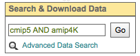

.. _user_guide:

User Tutorials
==============

Login/OpenID
************

.. note:: In May 2014, ESGF portals began using the ESGF OpenID authentication system. If you have an *older* OpenID you need to re-register.

.. note:: OpenIDs issued by earthsystemgrid.org are not supported in the ESGF anymore.

Create an account
-----------------

* Many projects are public, and can be viewed without creating an account.
* An account will allow you to join a project and edit that project's wiki pages.
* An account is required to download data from an ESGF node.

#. Create Account

    * Click on the "Create Account" link in the upper right corner of a portal page

    .. image:: images/login_link.png

#. Fill in the User Profile

    * Items in bold are mandatory.
    * Interest keywords, photo, and institution will show up on a project's People listing.

    .. image:: images/profile_blank.png

Join or Create a project
------------------------

.. note::  You do not need to join a project to download data.

To join a project or create a project, you must first have an account (step 1).

#. Join an existing project

    * Navigate to the project you are interested in. The project owner may send you the URL in an email, or you can use the Project Browser to view a list of projects.
    * Click the "Join the X project" in the upper right corner of the project page.
    * Wait for approval. Only project administrators can approve new members.

    .. image:: images/upper_links.png

#. Create a project

    .. note:: Don't request a new project just to download data, it will not be approved. If you are interested in data, navigate to the project hosting the data and follow their instructions for access.

    * Click the "Register a New Project" link in the upper right-hand corner of the portal environment

        .. image:: images/upper_links.png

    * Setting Project Options

        Below is a screenshot of the project registration page. A project **can** be modified after creation, with the exception of the project short name. This page allows project administrators to:

        * Define a project's description
        * Select a project's parents and peers
        * Add a project logo
        * Toggle privacy
        * Turn on Upper Navigation Bar links
        * Turn on standardized Resource folders
        * Turn on the data service widget
        * Turn on Forum notifications

        .. image:: images/register_project.png

.. _data_access_groups:

Authorization for ESGF data access
----------------------------------

Why data access control groups?
^^^^^^^^^^^^^^^^^^^^^^^^^^^^^^^
Often data users must accept a "terms of use" (e.g. agree to acknowledge the data producers in publications) before downloading data.
Therefore, the creation of a ESGF portal account is normally not sufficient for data access, you also need the authorization to access data.
User's must join a data access control group for the project they wish to download data from.
If the right group is not joined, for example, Wget scripts will prematurely fail with a "Forbidden" error message.

Which data access control groups currently exist in ESGF?
^^^^^^^^^^^^^^^^^^^^^^^^^^^^^^^^^^^^^^^^^^^^^^^^^^^^^^^^^
Below is a list of access control groups by project:

+----------+----------------------------------------+
| Project  | Group Name                             |
+==========+========================================+
| CORDEX   | CORDEX Research, CORDEX Commercial     |
+----------+----------------------------------------+
| EUCLIPSE | CMIP5 Research                         |
+----------+----------------------------------------+
| GeoMIP   | CMIP5 Research                         |
+----------+----------------------------------------+
| LUCID    | CMIP5 Research                         |
+----------+----------------------------------------+
| PMIP3    | CMIP5 Research                         |
+----------+----------------------------------------+
| TAMIP    | CMIP5 Research                         |
+----------+----------------------------------------+
| ISI-MIP  | ISI-MIP Research, ISI-MIP Unrestricted |
+----------+----------------------------------------+
| specs    | SPECS                                  |
+----------+----------------------------------------+

 For example, membership in the CMIP5 Research group is required for download of data from the "sattilite MIPs" from the CMIP5 era, with the exception of ISI-MIP.
 Other projects such as CORDEX have their own groups. Which CORDEX data can only be used for non-commercial
 purposes and which thoroughly is listed in the `CORDEX Models overview <https://is-enes-data.github.io/CORDEX_RCMs_info.html>`_.  The CMIP projects (3-6) datasets are available without restriction, as are input4MIPs and obs4MIPs.

Who has to join?
^^^^^^^^^^^^^^^^
Everyone who has created a account and wants to download data from one of the projects listed in the table above must join the appropriate
access control group. This will need to be repeated for each ESGF OpenID since ESGF cannot assign group memberships to persons, only to OpenIDs.
You will need to do this for each group you need data from. It is not necessary to create a new account for each group. It is possible to have
several memberships with one OpenID.

How to join?
^^^^^^^^^^^^
Two different ways to join a data access control group in ESGF:

#. View list of data access control groups
    A comprehensive list of access control groups can be found at: `ESGF Data Access Control Groups <https://esgf-node.jpl.nasa.gov/ac/list/>`_,
    which contains a list of groups and links for registration. Note, the home pages of ESGF nodes may list or exclude groups based on their individual holdings.
#. Download a file with your browser
    The easiest way to join a data access control group is a download a file with your browser's download manager.
    This process will automatically present a window for group registration.

    a. In an ESGF portal, select a dataset with data of the project you are interested in and click on "Show Files".

        .. image:: images/group_registration_select_dataset.png

    b. Click on "HTTPServer"

        .. image:: images/group_registration_filelist.png

    c. After login you will be guided to the Group Registration Request page if a group membership is missing.

        .. image:: images/group_registration_groups.png

    d. Choose a group and click on "Register".
        * A sub-window opens with the terms of use.
        * After accepting the terms, group membership is immediately active and the download window will open.

        .. image:: images/group_registration_terms.png

Logging in with OpenID
----------------------
.. note:: An OpenID is merely a username in the form of a URL. Do not try to open this URL in a browser window.

.. note:: ESGF uses a self-signed SSL certificate. Your browser may reject this with a security warning. View section "`Get your browser to accept the ESGF certificate`_" on how to manually clear this warning.

Method 1: Enter your full OpenID
^^^^^^^^^^^^^^^^^^^^^^^^^^^^^^^^
#. Enter your full OpenID in the login box and click "Login"

    .. image:: images/login.png

#. Enter your password in the ESGF OpenID password box

    .. image:: images/chrome_sucess.png

Method 2: Use the pull down to select your OpenID issuer
^^^^^^^^^^^^^^^^^^^^^^^^^^^^^^^^^^^^^^^^^^^^^^^^^^^^^^^^
* If your provider is not listed in the pulldown, then you have to use method 1 above.
* This method is a short cut to entering the full OpenID.

#. Use the arrow icon to invoke the list of OpenID providers

    .. image:: images/openid_selector.png

#. Enter your username and password

    .. image:: images/openid_user_pw.png

Forgot OpenID
-------------

#. Go to the Login page of any ESGF portal, e.g `<esgf-data.dkrz.de>`_, `<esgf-node.llnl.gov>`_, ...

    .. image:: images/login_link.png

#. Click the Forgot OpenID link located beneath the login box

    .. image:: images/login_empty.png

#. Fill out the template

    .. image:: images/forgot_openid.png

..  _forgot_password:

Forgot Password
---------------

* Passwords are associated with particular OpenIDs, which may be issued from an ESGF node other than the one currently logged into.
* Passwords can only be retrieved if logged into the ESGF node that issued the ESGF OpenID.

#. Click the Login link in the upper right corner of the page

    .. image:: images/login_link.png

#. Click the "Forgot Password?" link on the login page

    .. image:: images/forgot_openid.png

#. Enter the ESGF OpenID and email associated with that OpenID into the form and submit

    .. image:: images/forgot_password.png

Update Password
---------------

.. note:: The Update Password link is located on your "My Profile" page. You must be logged in to change your password.
    If you don't know your password, follow the instructions on section "`Forgot Password`_".

#. Login. See section "`Logging in with OpenID`_" for more information

#. Click on "My Profile"

    .. image:: images/my_profile.png

#. Click on Update password

    .. image:: images/change_password.png

..  _accept_esgf_cert:

Get your browser to accept the ESGF certificate
-----------------------------------------------
The SSL certificate used by ESGF is self-signed. Some browsers have difficulty with this certificate and users will need to tell their browser to trust it.
Every browser has a different mechanism for accepting SSL certificates it does not trust.

Firefox
^^^^^^^

#. Click on "Advanced"

    .. image:: images/ff_1.png

#. Click "Add Exception..."

    .. image:: images/ff_2.png

#. Click "Confirm Security Exception"

    .. image:: images/ff_3.png

#. Click "Resend"

    .. image:: images/ff_4.png

Safari
^^^^^^

.. note::  If you still can not display the ESGF login page after these steps AND you are using a Mac, please contact support. Some institutions, e.g. NASA, preinstall the ESGF certificate and this will have to be removed in order to be trusted. You may also which to switch to FireFox or Chrome.

#, Click the "Show Certificate" button

    .. image:: images/safari_1.png

#. Expand the Trust section

    .. image:: images/safari_2.png

#. Change the Trust settings

    .. image:: images/safari_3.png
    .. image:: images/safari_4.png

#. Authenticate

    .. image:: images/safari_5.png

Chrome
^^^^^^

#. Click "Advanced" on the warning page

    .. image:: images/chrome_1.png

#. Click "Proceed to $node (unsafe)"

    .. image:: images/chrome_2.png

Internet Explorer
^^^^^^^^^^^^^^^^^

#. Click the "Continue to this website (not recommended) link.

    .. image:: images/ie_1.png

Data Search and Download
************************

What the ESGF search returns
----------------------------

#. ESGF Search Basics

    The basic unit in ESGF is the dataset. Datasets are collections of individual files.
    Some datasets contain files that represent different variables. Some datasets are restricted to one variable.
    Other, like CMIP5, contained many datasets with multiple variables. To search for individual files, save a dataset to your Data Cart
    and search using the sub-select text box in the Data Cart itself
    (`see tutorial <https://esgf.github.io/esgf-user-support/user_guide.html#narrow-a-cmip5-data-search-to-just-one-variable>`_).

#. Search Defaults

    By default, ESGF searches are conducted across all nodes and return only the latest version of a dataset (without replicas).
    Use the check boxes (if enabled by the project administrator) below the text box to narrow the search (see figure). Note that searching the Local Node means searching on the node configured for this search. It is possible that node is not local.

    .. image:: images/search_options.png

#. Searching with AND/OR

    By default, all words entered into the text boxes in the Search Widget or on the Advanced Search
    Page are combined via a logical -OR-. To search via a logical -AND-, use the AND keyword.

    .. image:: images/logical_and.png

    .. image:: images/logical_and_advanced.png

Searching with AND/OR in the search text boxes
----------------------------------------------

By default, all words entered into the text boxes in the Search Widget or on the Advanced Search
Page (see figures below) are combined via a logical -OR-. To search via a logical -AND-, use the AND keyword.

.. image:: images/logical_and_advanced.png

Download a single file with the browser
---------------------------------------

From the ESGF, data search results can be downloaded

    * one file at a time with the browser or
    * several files together with scripts (Wget, Globus, Synda or Python, view separate tutorials).

This tutorial is a description how a file can be downloaded from ESGF without scripts and additional software, i.e. with the browser only. For the download of a single file, this is the easiest way and is recommended for beginners even if they need more than one file and want to switch to scripting because the user's authorization for data download can be completed embedded in a download with the browser.

#. Search for Data
    * Use the facets on the left of the search page to narrow the search.
    * Click the "Show Files" link below the dataset of interest.
    * Search results within ESGF are links to datasets, which are collections of files.

        * How many files exist within each dataset is up to the data publisher.
        * Some datasets contain just one variable, others contain multiple variables

    .. image:: images/datasearch.png

#. Authentication and Authorization

    * Click the "HTTPServer" link across from the file of interest.
    * The ESGF data node inquires your OpenID and password, the same password you need to login. If you already downloaded a file from the same data node during the same session, this step is omitted.
    * If a membership in a data access control group is missing, you are guided to the Group Registration Request page, where you can join such a group (accept the terms).

    .. image:: images/4_files.png

#. File Download

The download control window of your browser pops up. Start the download.

Data Cart basics
----------------

    * Users have a Data Cart associated with their account.
    * The Data Cart stores links to datasets of interest.
    * The links in the Data Cart persist unless removed.

#. Login

    * Click on the "Login" button in the upper right-hand corner of the page.

    .. image:: images/login_link_detail.png

#. Open the Data Widget

    * Click on the "Advanced Data Search" link in the Data Search widget.
    * Note not all projects have this widget enabled.

        * This may mean there is no data associated with that project OR
        * The project has chosen to provide an alternate means of linking to their data (e.g. an image on their home page).

#. Search for data

    * Use the facets on the left of the search page to narrow the search.

    .. image:: images/datasearch.png

#. Send data to the Data Cart

    * Click the "Add to Data Cart", located below each search result to store that file in the Data Cart.
    * Click the "Add all displayed result to Data Cart", located above the search results to store all displayed datasets in the Data Cart.

#. Access the the Data Cart

    The link "My Data Cart" is located right next to "My Profile" beneath the Earth System COG logo.

    .. image:: images/datacart_link.png

#. Explore the Features of the Data Cart

    * In addition to storing datasets, the Data Cart (Figure 5)  can be used to:

        * Explore the metadata associated with a dataset (click the "Show Metadata" link).
        * Send the dataset to the Live Access Server visualization service (click the "LAS Visualization" link). Note only CF compliant netCDF datasets work with LAS.
        * Generate a WGET download script (click the "WGET Script" link).

    * Individual datasets can be sent to the above services by selecting the check box next to the datasets of interest.
    * All saved datasets can be selected (click the "Select All Datasets" checkbox).
    * A dataset can be removed from the Data Cart (click the "Remove" link).
    * All datasets can be removed (click the "Remove All" link).

    .. image:: images/datacart.png

Narrow a CMIP5 data search to just one variable
-----------------------------------------------

Many users of CMIP5 data have complained that they can not download just one variable without downloading large files containing other variables.
This is because some CMIP modeling groups bundled their variables together when they published their datasets.

There is a way around this problem.

#. Save a dataset to your Data Cart (see Data Cart basics section).

#. Click the "Show Files" link associated with a particular dataset. In the example below you can see that there are 71 files associated with that dataset.

    .. image:: images/71_files.png

#. Enter the variable of interest into the text box at the top of the Data Cart. In this example the variable "omega" was entered. See how the list of files is reduced from 71 to 4. Selecting the dataset check box and the the "WGET Script" link will create a WGET script for just the variable of interest, in this case "omega".

    .. image:: images/4_files.png

Download data from ESGF using Wget
----------------------------------

One of the most powerful features of the Earth System Grid Federation (ESGF) is the capability to generate scripts to download files for arbitrary query parameters, that can download more than one file from one data node. The script generator is even able to create several scripts in one request if data from several data nodes are desired. Currently, these scripts are based on the wget command, which is typically installed by default on nearly all modern laptops and desktops. Before downloading the data, the script will prompt the user for their OpenID and password, which will be used to retrieve a short-lifetime digital certificate from the ESGF site where the user registered. This certificate (which is valid for only 72 hours) is passed by Wget to the server holding the data, as a proof of the user's identity.

ESGF Wget scripts are smart enough to recognize if files have already been downloaded and skip them. If the download was interrupted before having finished, simply run the script in the same directory again. The script will continue the download then. Even the download of a partially downloaded file will be continued.

ESGF Wget scripts can also help you to recognize if a new version of the downloaded data is available in ESGF. After download, keep the script and run it again with the option -u to search for new versions. The download itself is not repeated then but the download script is created again and is compared with the old one.

**Pre-requisites**

Before being able to execute a Wget download script, the following pre-requisites must be satisfied:

* The user needs the following software:

    * A UNIX-like operating system (Linux or Mac OS). Under Windows, Linux may be installed as a virtual machine (recommended). Many users instead utilize a UNIX emulation under Windows, e.g. Cygwin (not recommended but maybe easier than a Linux installation)
    * Wget application (version 1.12 or later) compliled with the OpenSSL libraries. Under Linux, this is already installed with one of the base packages usually. Nevertheless, Mac users may have to install Wget first (details see ESGF Wget FAQ). Cygwin users have to install the package Web-Wget (again run the Cygwin setup executable to install it).
    * Tools for calculation of SHA256 and MD5 checksums. Under Linux and Cygwin, this is already installed usually. Mac users may have to install these tools first.
    * For use of Wget scripts in the default mode additionally Oracle Java, version 1.7 or newer. OpenJRE is not sufficient. Java is not needed if Wget scripts are used with the options -H or -s (details see below).
* For unrestricted data, the user should use the -s option.  No authorization is required.
* The user must have been registered with one of the ESGF sites (portals). To register with an ESGF node, simply use a browser to visit the portal's home page and follow the Create Account link.
* The user must have been authorized to access the desired data, see tutorial "Authorization for ESGF data access".
* Network port 7512 (TCP) has to be open.

#. Generate a Wget script

    Login to an ESGF portal, perform a search and add all datasets you desire to your DataCart. Go to your DataCart.

    Many CMIP datasets contain several hundreds of files, some even more than thousand. If you want to download CMIP data, narrow your search with help of the text field (arrow "N"). In detail, take down the names of the variables you need delimited by a blank and press the Apply button. This affects also files inside a dataset and usually reduces the number of download files considerably. On the contrary, the categories "Variable", "Variable Long Name" and "CF Standard Name" in the search form only influence the dataset selection, not the selection of files inside a dataset.

        .. image:: images/Wget_DataCart.png

    In the DataCart, several links "WGET Script" are shown, for every dataset one (e.g. arrow "1") and additionally one for all selected datasets (arrow "all"). To select a dataset click on the little square left of the dataset. The link at every dataset allows creation of a separate Wget script for the one dataset only. After clicking on one of these links, the download manager of your browser pops up a control window for script download. In the case of Chrome, the downloaded script will appear at the bottom of the browser. Download the script to your local machine now.

#. Edit the script (optional)

    The file name wget-############.sh of the downloaded script begins with wget- followed by a time stamp, a number and the extension .sh. The script is a UNIX Shell script and may be edited with a text editor. In this way, you may shorten the list of download files, e.g. if you do not need data for all available periods. Do not change other parts of the script.

#. Run the script

    Open a terminal window. Mac users can find a terminal icon in the Launchpad.

    If the datasets to be downloaded are unrestricted, run the script with the option -s.
    ::

        bash wget-xxx.sh -s

    If Oracle Java is available, run the script in the default mode:
    ::

        bash wget-xxx.sh

    Otherwise run the script with option -H to avoid use of Java and locally downloaded certificates.
    ::

        bash wget-xxx.sh -H

    The bash command in front of the script name opens the right Shell for running the script. The script will ask you for your OpenID and password. Only in default mode and if you run several downloads from the same ESGF data node, this will be skipped and a locally stored credential will be used for authentication instead.

Alternative for step 1
    Create a wget script using a special URL

    Wget scripts can also be generated with help of the ESGF Search RESTful API, which can be used by a script or by simply typing-in a URL augmented with commands, which are interpreted by an ESGF index node (portal). For example, the following URL will generate a Wget script that match all CMIP5 files in the ESGF, across all sites:

    http://esgf-data.dkrz.de/esg-search/wget?project=CMIP5

    Nevertheless, this script will contain download links for only the first 1000 files, the recent limit for the number of download files. CMIP5 has much more. For generation of a useful script, more selection commands are needed. For example,

    http://esgf-data.dkrz.de/esg-search/wget?project=CMIP5&experiment=decadal2000&variable=tas

    will generate a script for download of all surface temperature files for experiment decadal2000 across all CMIP5 models.

    The blanks in the category name (facet name) you may know from the ESGF portal surface, for example in "Time Frequency", have to be replaced by underscores:

    http://esgf-data.dkrz.de/esg-search/wget?project=CMIP5&experiment=decadal2000&variable=tas&time_frequency=day

    Selection commands are delimited by an ampersand and interpreted in the sense of a logical AND, except those specifying the same category. For example, in

    http://esgf-data.dkrz.de/esg-search/wget?experiment=decadal2000&variable=tas&variable=tasmax

    the category variable is used twice. These two selection commands are interpreted in the sense of a logical OR, in detail:

        experiment=decadal2000 AND (variable=tas OR variable=tasmax)

    A script will be generated for download of all decadal2000 files containing the variables tas or tasmax, i.e. both variables will be downloaded in one script run.

    Use as much selection commands as possible and useful in your case to reduce the number of download files. For some power users, thousand files in one script run may not be suffient. They can use the limit command to raise the limit for the number of download files, e.g.:

    http://esgf-data.dkrz.de/esg-search/wget?experiment=decadal2000&variable=tas&limit=2000

    This additional command would enable the example URLs above (except the first) to create a script with a complete file list. Please note that a limit of more than 10000 files will generally not be accepted.

    Another nice feature for users who need many data files is preservation of the directory structure with the command download_structure. This command can be used to define a directory tree at the user's local machine. If you want to copy the files to a directory tree which is also used in ESGF for CMIP5 data, utilize the following command:

    download_structure=project,product,institute,model,experiment,time_frequency,realm,cmor_table,ensemble,variable

    Accordingly the same for CORDEX:

    download_structure=project,product,domain,institute,driving_model,experiment,ensemble,rcm_name,rcm_version,time_frequency,variable

    Last an example for a complete URL with preservation of the CMIP5 directory tree:

    http://esgf-data.dkrz.de/esg-search/wget?experiment=decadal2000&variable=tas&limit=2000&download_structure=project,product,institute,model,experiment,time_frequency,realm,cmor_table,ensemble,variable

Wget script options
    ESGF Wget scripts can be run with options. For an overview of possible options type-in.

    ::

        bash wget-##############.sh -h

     (-h for help). Different options can be combined. The following options are important:

    -d, the debug option
        This option causes the script to send more than the usual response to standard output. Use

        ::

            bash wget-##############.sh -H -d

        if you have problems with option -H since scripts run with option -H are nearly silent. They don't even send useful error messages.

        **Caution**: Do not send your standard output to the user support mailing list esgf-user@lists.llnl.gov because option -d may cause the script to print your password! Everyone can subscribe to esgf-user@lists.llnl.gov and your post will be distributed to every subscriber.

    -H, the certificate-less option
        Since many users have problems with Java and certificates on their local machines, the option -H was developed to avoid use of Java and locally stored certificates. Instead, your OpenID and password are sent with help of a Wget command. Your password is encrypted with SSL (or TLS if you have additionally switched to TLS with option -T). Without option -H, a local credential is created and sent to ESGF servers for the user's authentication but Oracle Java 1.7+ is needed for this purpose.

    -i, the "insecure" option
        This option disables check of server certificates. This has nothing to do with locally stored certificates and option -H. On the contrary, in a Grid as ESGF authentication is needed in two directions: The user has to authenticate herself/himself at the server and the server has to authenticate itself at the user's local machine. You may use

        ::

            bash wget-##############.sh -i

        to switch off the check of the server certificate by your local machine. This is sometimes helping in case of an expired server certificate. Before use of this option, you should ask your system administrator if you are allowed to do this.

    -p, the preserve option
        After download, the Wget script calculates a checksum for the freshly downloaded file. If -p is not set, downloaded files will usually be deleted if their checksum does not match the value in the script's file list. Afterwards, download will be repeated until it succeeds. This feature shall automatically correct alterations in the bitstream of the downloaded file. Use the -p option to suppress file deletion.

         ::

            bash wget-##############.sh -p

        The downloaded file will then be preserved despite checksum mismatch. This option does not suppress checksum comparison. In case the calculated checksum of a downloaded file does not match the checksum in the download file list, a warning will be thrown. This option may be useful if the checksum stored in the data node's metadata is outdated (seldom but already happened).

    -T, the TLS option
        Network traffic between ESGF servers and the user's local machine is usually encrypted using SSL (Secure Sockets Layer). The option -T switches to TLS v1 (Transport Layer Security) instead of SSL.

    Find changes with -u
        The option -u is used to repeat the search and find changes in the download file list. In more detail, the Wget script is again generated and compared with the old, locally stored Wget script. New available files are listed as well as new versions of previously downloaded files since the checksum of a replaced file differs from that of the old version. Other changes in the script are also shown. If a modification is detected, the Wget script will be updated and the previous version will be stored at my_wget_script.old.# where # is just a running index. This option needs the UNIX diff program. Data files will not be downloaded.

Download and browse data from ESGF with OPeNDAP
-----------------------------------------------

OPeNDAP is a data transport architecture and can be used for data download, data browsing and data processing, for example image creation. This page describes data download and browsing in the ESGF via OPeNDAP, especially how to

* Browse attributes (global attributes and variable-specific attributes in the NetCDF file header)
* Convert data format to ASCII or dodc
* Cut out data for a specific area and period
* Access data with own software

Access via an ESGF portal
^^^^^^^^^^^^^^^^^^^^^^^^^^^^^^^
Data access via OPeNDAP is possible by using any ESGF portal. Perform a usual ESGF search, an example is in the image below.

    .. image:: images/results.PNG

Click on "Show Files" for a file listing.

    .. image:: images/show-files.PNG

Click on "OPENDAP" to reach the OPeNDAP Dataset Access Form.

    .. image:: images/dataset-access-form.PNG

The OPeNDAP Dataset Access Form consists of a global attributes block and many coordinate variable blocks (in the example time, lat, lat_bnds, lon, lon_bnds) followed by the data variable block (in the example psl). The attributes are taken from the NetCDF file header and can directly be browsed in the blocks.

If you want to cut out an area or period, you may do the following:

* Enable all the coordinate variables to find out which indices you need (check the checkboxes)
* Click on the “Get ASCII” button
* You are asked for your ESGF OpenID and password
* The ASCII output contains the values of the coordinate variables. The same indices will be used in the data variable array. Choose an index range
* Check the data variable checkbox and type-in your index ranges there, as done in the screen shot above. Three integers should be set for each coordinate variable: lower boundary index, increment, upper boundary index. If the increment is greater than 1, data would be leaved out. For example, an increment of 2 means that every second value is taken
* Click on the “Get ASCII” button again for text format or "Get Binary" for dodc. Only these two data formats are available here, not NetCDF

Result in text format for the filled-in OPeNDAP Dataset Access Form above:

        ::

            Dataset {
                Grid {
                 ARRAY:
                    Float32 psl[time = 1][lat = 6][lon = 6];
                 MAPS:
                    Float64 time[time = 1];
                    Float64 lat[lat = 6];
                    Float64 lon[lon = 6];
                } psl;
            } cmip5/cmip5/output1/MPI-M/MPI-ESM-LR/rcp45/6hr/atmos/6hrPlev/r1i1p1/v20111006/psl/psl_6hrPlev_MPI-ESM-LR_rcp45_r1i1p1_2100010100-2100123118.nc;
            ---------------------------------------------
            psl.psl[1][6][6]
            [0][0], 101965.19, 101979.19, 101995.44, 102007.69, 102016.19, 102012.69
            [0][1], 101990.19, 101997.69, 102004.94, 101997.94, 101986.94, 101978.44
            [0][2], 101932.44, 101936.19, 101921.44, 101885.94, 101856.94, 101856.19
            [0][3], 101808.69, 101803.44, 101784.69, 101757.19, 101739.44, 101746.69
            [0][4], 101676.69, 101653.94, 101638.44, 101634.19, 101638.19, 101645.94
            [0][5], 101527.69, 101498.44, 101475.19, 101468.94, 101477.19, 101482.94

            psl.time[1]
            91311.0

            psl.lat[6]
            -32.64199447631836, -30.776744842529297, -28.9114933013916, -27.046239852905273, -25.180986404418945, -23.315731048583984

            psl.lon[6]
            84.375, 86.25, 88.125, 90.0, 91.875, 93.75

You may copy and paste e.g. the data variable array to a file now. If you have chosen "Get Binary", a download window for the dodc file pops-up.

Aggregations
^^^^^^^^^^^^
Usually, data is divided into files of reasonable size, reasonable for downloads of whole files. This cut has been done along the time coordinate, i.e. each file contains data belonging to one or few years only. Since the main purpose of OPeNDAP is not the download of whole files, concatenated time series have been made accessible via OPeNDAP, the aggregations.

Aggregations cannot be found in portals. They are only available from ESGF data nodes. Generally, aggregations may only be in the data node that has stored the non-aggregated data. An ESGF portal can therefore be used to find the right data node. Go to the THREDDS catalog of that data node and browse it. When you have found the right dataset, click on its link to get the file list. For the example above, the beginning of the file list is shown in the screenshot below.

    .. image:: images/thredds1.PNG

Scroll down the list until you find the aggregation you need. In the example below, the link to the aggregation has the extension .aggregation.

    .. image:: images/thredds2.png

Aggregations may be divided into several parts, which are of course longer than the time period of a single non-aggregated file. The aggregation link leads to the page shown in the screenshot below.

    .. image:: images/thredds3.PNG

The time period of the aggregation can be taken from section "Time Coverage". Clicking on the link in section "Access" will open the aggregation's OPeNDAP Dataset Access Form. The form can be handled in the same way as for non-aggregated data.

OPeNDAP data URL
^^^^^^^^^^^^^^^^
The filled OPeNDAP Dataset Access Form in the example above leads to the following URL if "Get ASCII" is pressed:

https://esgf1.dkrz.de/thredds/dodsC/cmip5/cmip5/output1/MPI-M/MPI-ESM-LR/rcp45/6hr/atmos/6hrPlev/r1i1p1/v20111006/psl/psl_6hrPlev_MPI-ESM-LR_rcp45_r1i1p1_2100010100-2100123118.nc.ascii?psl[0:1:0][30:1:35][45:1:50]

Behind the file extension .ascii it consists of the variable name (in the example "psl") and the variable's index ranges. This URL may be used, for example, by a program for direct data processing. Index ranges and file extension may be changed:

* .dods instead of .ascii points to the binary file
* .dds to the Dataset Descriptor Structure file, which is identical with the text header of the dods file
* .das to the Data Attribute Structure file containing the attributes (text format)

The Dataset Descriptor Structure (DDS) for the example above:

    ::

        Dataset {
            Grid {
            ARRAY:
                Float32 psl[time = 1][lat = 6][lon = 6];
            MAPS:
                Float64 time[time = 1];
                Float64 lat[lat = 6];
                Float64 lon[lon = 6];
            } psl;
        } cmip5/cmip5/output1/MPI-M/MPI-ESM-LR/rcp45/6hr/atmos/6hrPlev/r1i1p1/v20111006/psl/psl_6hrPlev_MPI-ESM-LR_rcp45_r1i1p1_2100010100-2100123118.nc;

Access data with the command line via OPeNDAP
^^^^^^^^^^^^^^^^^^^^^^^^^^^^^^^^^^^^^^^^^^^^^
OPeNDAP data URLs may be used with local software, for example your own script. Since data access is restricted to registered users in ESGF, valid credentials have to be sent with your requests. These credentials can be created on the command line, embedded in a download of a single file with an ESGF Wget script or with the following myproxy command:

    ::

        myproxy-logon -s <my_ESGF_portal> -l <username> -b -T -t 72 -o ~/.esg/credentials.pem

<my_ESGF_portal> is the DNS name of the portal which you used to create your ESGF account, for example pcmdi.llnl.gov; <username> is not the complete OpenID but its last part only, your user name. Some Linux distributions offer a package myproxy, which also contains the myproxy-logon tool. ESGF Wget scripts and myproxy-logon create and fetch all needed credentials or renew expired local certificates. ESGF Wget scripts automatically create the credentials directory with name .esg in your HOME directory whereas myproxy-logon expects an existing directory .esg in your HOME. In .esg, the file credentials.pem contains two certificates and the private key you need for data access.

In ESGF, user certificates are short-term certificates valid for 72 hours maximum. The exact value depends on the settings in the Identity Provider (IdP) which has issued your OpenID. In a UNIX Shell, you can inquire the period of validity with the following command:

    ::

        openssl x509 -text -noout -in $HOME/.esg/credentials.pem

The period of validity will be appended to standard output (console) among other output. Example:

    ::

        Validity
            Not Before: Jun 24 16:23:10 2016 GMT
            Not After : Jun 27 16:28:10 2016 GMT

If you only want to create or renew your certificate with help of an ESGF Wget script, choose a short data file for download, e.g. a fixed-field file. For example, the surface altitude (variable orog) is time-independent and, hence, orog files are short.

Next, you need an OPeNDAP configuration file .dodsrc in your HOME directory. It can be generated, for example, with the following UNIX command:

    ::

        cat > .dodsrc << EOF
        HTTP.COOKIEJAR=${HOME}/.esg/dods_cookies
        HTTP.SSL.VALIDATE=0
        HTTP.SSL.CERTIFICATE=${HOME}/.esg/credentials.pem
        HTTP.SSL.KEY=${HOME}/.esg/credentials.pem
        HTTP.SSL.CAPATH=${HOME}/.esg/credentials.pem
        EOF

With these preparations, access of ESGF OPeNDAP data should be possible. For example ESGF OPeNDAP data can directly be processed with ncdump:

    ::

        ncdump -h http://esgf1.dkrz.de/thredds/dodsC/cmip5/cmip5/output1/MPI-M/MPI-ESM-LR/rcp45/6hr/atmos/6hrPlev/r1i1p1/v20111006/psl/psl_6hrPlev_MPI-ESM-LR_rcp45_r1i1p1_2100010100-2100123118.nc

ncdump belongs to the `NetCDF software <https://www.unidata.ucar.edu/software/netcdf/>`_ and converts the binary NetCDF file to text. The option -h causes ncdump to output the file header only.

A second example: Use of `Climate Data Operators (CDO) <https://code.mpimet.mpg.de/projects/cdo/wiki>`_

    ::

        cdo showformat http://esgf1.dkrz.de/thredds/dodsC/cmip5/cmip5/output1/MPI-M/MPI-ESM-LR/rcp45/6hr/atmos/6hrPlev/r1i1p1/v20111006/psl/psl_6hrPlev_MPI-ESM-LR_rcp45_r1i1p1_2100010100-2100123118.nc

cdo showformat simply outputs the format of the specified climate data file.

Also possible: Download using the Wget command

    ::

        wget --certificate ${HOME}/.esg/credentials.pem --private-key=${HOME}/.esg/credentials.pem --ca-certificate=${HOME}/.esg/credentials.pem --no-check-certificate http://esgf1.dkrz.de/thredds/dodsC/cmip5/cmip5/output1/MPI-M/MPI-ESM-LR/rcp45/6hr/atmos/6hrPlev/r1i1p1/v20111006/psl/psl_6hrPlev_MPI-ESM-LR_rcp45_r1i1p1_2100010100-2100123118.nc.ascii?psl[0:1:0][30:1:35][45:1:50]

This Wget command writes the same text file as shown above in the first text box. .dods, .dds and .das files can be created using the corresponding file extension in the command.

The credentials directory .esg may also be copied from another computer where it already exists.

Synda
^^^^^
Synda is a data synchronization and download tool that can be used by users in order to easily download files hosted on ESGF data nodes. 

Starting August 2019, It can be obtained via conda package to ease installation for average users and still maintain a reliable release workflow to data managers wishing to replicate data across the grid. 

Further information about the tool (installation, configuration, usage, contact and contribution to the tool) can be found `here <https://portal.enes.org/data/data-metadata-service/data-discovery/synda>`_.

Own Python scripts
^^^^^^^^^^^^^^^^^^
The `esgf-pyclient package <https://pypi.org/project/esgf-pyclient/>`_ enables data access via OPeNDAP and also contains an interface to the ESGF Search API (see the ESGF Search RESTful API tutorial section) and a help function for login. Find the documentation `here <https://esgf-pyclient.readthedocs.io/en/latest/>`_.

A good starting point for an own script using esgf-pyclient is Carsten Ehbrecht's demo notebook. Once installed, this IPython notebook can be run in a web browser. It is an interactive worksheet, which enables a step-by-step run of search, login, data access and processing. Even changes in the `demo script <https://github.com/cehbrecht/demo-notebooks/blob/master/esgf-opendap.ipynb>`_ may be tried.

For installation of the demo notebook go to `Carsten's GitHub repository <https://github.com/cehbrecht/demo-notebooks/>`_, press the green button "Clone or download" to get the software and follow the instructions in the README.md file, i.e. install Conda and run the three given initialization commands.

Download data using Globus Online
---------------------------------

ESGF is starting to enable `Globus <https://www.globus.org/>`_ as one of the options for downloading data to the user personal laptop. When available, Globus allows for easier, faster and more reliable downloads. "Globus Download" will show up as an additional access option when datasets are found by the ESGF Search, and when those datasets are saved in the Data Cart.

Setup Globus
^^^^^^^^^^^^
* Sign up for a `Globus Account <https://auth.globus.org/p/login?client_name=globus_webapp&redirect_uri=%2Fv2%2Foauth2%2Fauthorize%3Fclient_id%3D89ba3e72-768f-4ddb-952d-e0bb7305e2c7%26client_name%3Dglobus_webapp%26scope%3Durn%253Aglobus%253Aauth%253Ascope%253Aauth.globus.org%253Aview_identities%2520urn%253Aglobus%253Aauth%253Ascope%253Anexus.api.globus.org%253Agroups%2520urn%253Aglobus%253Aauth%253Ascope%253Atransfer.api.globus.org%253Aall%26response_type%3Dtoken%26redirect_uri%3Dhttps%253A%252F%252Fwww.globus.org%252Fapp%252Flogin%26redirect_name%3DGlobus%2520Web%2520App%26state%3Do5freyqqm7l%26signup%3D1&response_type=token&client_id=89ba3e72-768f-4ddb-952d-e0bb7305e2c7&scope=urn%3Aglobus%3Aauth%3Ascope%3Aauth.globus.org%3Aview_identities+urn%3Aglobus%3Aauth%3Ascope%3Anexus.api.globus.org%3Agroups+urn%3Aglobus%3Aauth%3Ascope%3Atransfer.api.globus.org%3Aall&signup=1&redirect_name=Globus+Web+App>`_  (free)
* Install the `Globus Connect Personal <https://www.globus.org/globus-connect-personal>`_  client on their machine (click-through)
* Additionally, to use the Python scripts (download option #2 below), the user needs to upload their public ssh key to the Globus site (`see instructions <https://docs.globus.org/faq/ssh-keys-and-x509-certs/>`_ )

Globus Transfer
^^^^^^^^^^^^^^^
A user is allowed to start a Globus data transfer request by following the "[Globus Download]" link that will show up for enabled datasets.

    .. image:: images/globus_link.png

There are two options for submitting this request.

* **Option 1: Web Download.** The user submits the download request entirely through the web browser. He/she will be asked to sign-in to the Globus site (if not signed in already), and to select the destination Collection/Endpoint and folder using the Globus File Manager.  The destination could be a remote location, eg. a compute center or Globus Connect Personal that runs on a local system, eg. the user's laptop.
* **Option 2: Script Download.** The user will download a Python script that he/she can later execute to submit the request. Python must be already installed on the user's machine, but no special libraries are needed. The general syntax to execute the script is: python globus_download_yyyymmddhhmmss.py -e <your globus endpoint> -u your globus username> -p <target directory>. For example: python globus_download_20150101033422.py -e globuser#themac -u globuser

    .. image:: images/globus_page.png

You will get a confirmation that your download has started, but no matter how a data transfer request is started, the user must use the `Globus Activity <https://auth.globus.org/p/login?client_name=globus_webapp&redirect_uri=%2Fv2%2Foauth2%2Fauthorize%3Fclient_id%3D89ba3e72-768f-4ddb-952d-e0bb7305e2c7%26client_name%3Dglobus_webapp%26scope%3Durn%253Aglobus%253Aauth%253Ascope%253Aauth.globus.org%253Aview_identities%2520urn%253Aglobus%253Aauth%253Ascope%253Anexus.api.globus.org%253Agroups%2520urn%253Aglobus%253Aauth%253Ascope%253Atransfer.api.globus.org%253Aall%26response_type%3Dtoken%26redirect_uri%3Dhttps%253A%252F%252Fwww.globus.org%252Fapp%252Flogin%26redirect_name%3DGlobus%2520Web%2520App%26state%3D132y5iamjyao&response_type=token&client_id=89ba3e72-768f-4ddb-952d-e0bb7305e2c7&scope=urn%3Aglobus%3Aauth%3Ascope%3Aauth.globus.org%3Aview_identities+urn%3Aglobus%3Aauth%3Ascope%3Anexus.api.globus.org%3Agroups+urn%3Aglobus%3Aauth%3Ascope%3Atransfer.api.globus.org%3Aall&redirect_name=Globus+Web+App>`_ page to monitor their transfer. Additionally, Globus will send an email to the user at job completion.

    .. image:: images/globus_confirmation.png

.. _restful_api:

The ESGF search RESTful API
---------------------------
The ESGF search service exposes a RESTful URL that can be used by clients (browsers and desktop clients) to query the contents of the underlying search index, and return results matching the given constraints. Because of the distributed capabilities of the ESGF search, the URL at any Index Node can be used to query that Node only, or all Nodes in the ESGF system.

Syntax
^^^^^^

The general syntax of the ESGF search service URL is:

    ::

        http://<base_search_URL>/search?[keyword parameters as (name, value) pairs][facet parameters as (name,value) pairs]

where "<base_search_url>" is the base URL of the search service at a given Index Node.

All parameters (keyword and facet) are optional. Also, the value of all parameters must be URL-encoded, so that the complete search URL is well formed.

Keywords
^^^^^^^^

Keyword parameters are query parameters that have reserved names, and are interpreted by the search service to control the fundamental nature of a search request: where to issue the request to, how many results to return, etc.

The following keywords are currently used by the system - see later for usage examples:

* **facets** = to return facet values and counts
* **offset** = , limit= to paginate through the available results (default: offset=0, limit=10)
* **fields** = to return only specific metadata fields for each matching result (default: fields=*)
* **format** = to specify the response document output format
* **type** = (searches record of the specified type: Dataset, File or Aggregation)
* **replica=false/true** (searches for all records, or records that are NOT replicas)
* **latest=true/false** (searches for just the latest version, or all versions)
* **distrib=true/false** (searches across all nodes, or the target node only)
* **shards** = (searches the specified shards only)
* **bbox** =[west, south, east, north] (searches within a geo-spatial box)
* **start** =, end= (select records based on their nominal data coverage, i.e. their datetime_start, datetime_stop values )
* **from** =, to= (select records based on when the data was marked as last modified, i.e. their nominal "timestamp" value)

Default Query
^^^^^^^^^^^^^
If no parameters at all are specified, the search service will execute a query using all the default values, specifically:

    query=* (query all records)
    distrib=true (execute a distributed search)
    type=Dataset (return results of type "Dataset")

Example:

    https://esgf-node.llnl.gov/esg-search/search?

Free Text Queries
^^^^^^^^^^^^^^^^^
The keyword parameter query= can be specified to execute a query that matches the given text _ anywhere _ in the records metadata fields. The parameter value can be any expression following the Apache Lucene query syntax (because it is passed "as-is" to the back-end Solr query), and must be URL- encoded. When using the portal user interface at any ESGF node and project, the "query=" parameter value must be entered in the text field at the top of the page.

Examples:

* Search for any text, anywhere: http://esgf-node.llnl.gov/esg-search/search?query=* (the default value of the query parameter)
* Search for "humidity" in all metadata fields: http://esgf-node.llnl.gov/esg-search/search?query=humidity
* Search for the exact sentence "specific humidity" in all metadata fields (the sentence must be surrounded by quotes and URL-encoded): http://esgf-node.llnl.gov/esg-search/search?query=%22specific%20humidity%22
* Search for both words "specific" and "humidity", but not necessarily in an exact sequence (must use a space between the two words = this is the same as executing a query with the logical OR): http://esgf-node.llnl.gov/esg-search/search?query=specific%20humidity
* Search for the word "observations" ONLY in the metadata field "product" : http://esgf-node.llnl.gov/esg-search/search?query=product:observations
* Using logical AND: http://esgf-node.llnl.gov/esg-search/search?query=airs%20AND%20humidity (must use upper case "AND")
* Using logical OR: http://esgf-node.llnl.gov/esg-search/search?query=airs%20OR%20humidity (must use upper case "OR"). This is the same as using simply a blank space: http://esgf-node.llnl.gov/esg-search/search?query=airs%20humidity )
* Search for a dataset with a specific id: http://esgf-node.llnl.gov/esg-search/search?query=id:obs4MIPs.NASA-JPL.AIRS.hus.mon.v20110608|esgf-data.jpl.nasa.gov
* Search for all datasets that match an id pattern: http://esgf-node.llnl.gov/esg-search/search?query=id:obs4MIPs.NASA-JPL.AIRS.*

Facet Queries
^^^^^^^^^^^^^
A request to the search service can be constrained to return only those records that match specific values for one or more facets. Specifically, a facet constraint is expressed through the general form: <facet_name>=<facet_value>, where <facet_name> is chosen from the controlled vocabulary of facet names configured at each site, and must match exactly one of the possible values for that particular facet.

When specifying more than one facet constraint in the request, multiple values for the same facet are combined with a logical OR, while multiple values for different facets are combined with a logical AND. Also, multiple possible values for teh same facets can be expressed as a comma-separated list. For example:

* experiment=decadal2000&variable=hus : will return all records that match experiment=decadal2000 AND variable=hus
* variable=hus&variable=ta : will return all records that match variable=hus OR variable=ta
* variable=hus,ta : will also return all records that match variable=hus OR variable=ta

A facet constraint can be negated by using the != operator. For example, model!=CCSM searches for all items that do NOT match the CCSM model. Note that all negative facets are combined in logical AND, for example, model!=CCSM&model!=HadCAM searches for all items that do not match CCSM, and do not match HadCAM.

By default, no facet counts are returned in the output document. Facet counts must be explicitly requested by specifying the facet names individually (for example: facets=experiment,model) or via the special notation facets=*. The facets list must be comma-separated, and white spaces are ignored.

If facet counts is requested, facet values are sorted alphabetically (facet.sort=lex), and all facet values are returned (facet.limit=-1), provided they match one or more records (facet.mincount=1)

The "type" facet must be always specified as part of any request to the ESGF search services, so that the appropriate records can be searched and returned. If not specified explicitly, the default value is type=Dataset .

Examples:

* Single facet query: http://esgf-node.llnl.gov/esg-search/search?cf_standard_name=air_temperature
* Query with two different facet constraints: http://esgf-node.llnl.gov/esg-search/search?cf_standard_name=air_temperature&project=obs4MIPs
* Combining two values of the same facet with a logical OR: http://esgf-node.llnl.gov/esg-search/search?project=obs4MIPs&variable=hus&variable=ta (search for all obs4MIPs files that have variable "ta" OR variable "hus")
* Using a negative facet:

    http://esgf-node.llnl.gov/esg-search/search?project=obs4MIPs&variable=hus&variable=ta&model!=Obs-AIRS (search for all obs4MIPs datasets that have variable ta OR hus, excluding those produced by AIRS)
    http://esgf-node.llnl.gov/esg-search/search?project=obs4MIPs&variable!=ta&variable!=huss (search for all obs4MIPs datasets that do not contain neither variable ta nor variable huss)

* Search a file by its tracking id: http://esgf-node.llnl.gov/esg-search/search?type=File&tracking_id=2209a0d0-9b77-4ecb-b2ab-b7ae412e7a3f
* Search a file by its checksum: http://esgf-node.llnl.gov/esg-search/search?type=File&checksum=83df8ae93e85e26df797d5f770449470987a4ecd8f2d405159995b5cac9a410c
* Issue a query for all supported facets and their values at one site, while returning no results (note that only facets with one or more values are returned): http://esgf-node.jpl.nasa.gov/esg-search/search?facets=*&limit=0&distrib=false

Facet Listings
^^^^^^^^^^^^^^
The available facet names and values for searching data within a specific project can be listed with a query of the form ...project=<project_name>&facets=*&limit=0 (i.e. return no results). Only facet values that match one or more records will be returned.

Examples:

* List all obs4MIPs facet names and values: http://esgf-node.llnl.gov/esg-search/search?project=obs4MIPs&facets=*&limit=0
* List all CMIP5 facet names and values: http://esgf-node.llnl.gov/esg-search/search?project=CMIP5&facets=*&limit=0

The same query with no project constraint will return all facet names and values for ALL data across the federation:

* List ALL facet names and values: http://esgf-node.llnl.gov/esg-search/search?facets=*&limit=0

To retrieve a listing of available values for only a few facets, simply specify a comma-separated list of facet names:

* List all values of model, experiment and project throughout the federation: http://esgf-node.llnl.gov/esg-search/search?facets=model,experiment,project&limit=0
* List all values of model, experiment for CMIP5 data: http://esgf-node.llnl.gov/esg-search/search?facets=model,experiment&project=CMIP5&limit=0

Temporal Coverage Queries
^^^^^^^^^^^^^^^^^^^^^^^^^
The keyword parameters start= and/or end= can be used to query for data with temporal coverage that **overlaps** the specified range. The parameter values can either be date-times in the format "YYYY-MM-DDTHH:MM:SSZ" (UTC ISO 8601 format), or special values supported by the Solr DateMath syntax.

Examples:

* Search for data in the past year: http://esgf-node.llnl.gov/esg-search/search?start=NOW-1YEAR (translates into the constraint datetime_stop:[NOW-1YEAR TO \*] or datetime_stop > NOW-1YEAR)
* Search for data before the year 2000: http://esgf-node.llnl.gov/esg-search/search?end=2000-01-01T00:00:00Z (translates into the constraint datetime_start:[* TO 2000-01-01T00:00:00Z] or datetime_start < 2000-01-01)

Spatial Coverage Queries
^^^^^^^^^^^^^^^^^^^^^^^^
The keyword parameter bbox=[west, south, east, north] can be used to query for data with spatial coverage that overlaps the given bounding box. As usual, the parameter value must be URL-encoded.

Examples:

    http://esgf-node.llnl.gov/esg-search/search?bbox=%5B-10,-10,+10,+10%5D ( translates to: east_degrees:[-10 TO *] AND north_degrees:[-10 TO *] AND west_degrees:[* TO 10] AND south_degrees:[* TO 10] )

Please note though that NOT all ESGF records contain geo-spatial information, and therefore will not be returned by a geo-spatial search.

Distributed Queries
^^^^^^^^^^^^^^^^^^^
The keyword parameter distrib= can be used to control whether the query is executed versus the local Index Node only, or distributed to all other Nodes in the federation. If not specified, the default value distrib=true is assumed.

Examples:

* Search for all datasets in the federation: http://esgf-node.llnl.gov/esg-search/search?distrib=true
* Search for all datasets at one Node only: http://esgf-node.llnl.gov/esg-search/search?distrib=false

Shard Queries
^^^^^^^^^^^^^
By default, a distributed query (distrib=true) targets all ESGF Nodes in the current peer group, i.e. all nodes that are listed in the local configuration file /esg/config/esgf_shards.xml , which is continuously updated by the local node manager to reflect the latest state of the federation. It is possible to execute a distributed search that targets only one or more specific nodes, by specifying them in the "shards" parameter, as such: shards=hostname1:port1/solr,hostname2:port2/solr,.... . Note that the explicit shards value is ignored if distrib=false (but distrib=true by default if not otherwise specified).

Examples:

* Query for CMIP5 data at the PCMDI and CEDA sites only: http://esgf-node.llnl.gov/esg-search/search?project=CMIP5&shards=pcmdi.llnl.gov/solr,esgf-index1.ceda.ac.uk/solr
* Query for all files belonging to a given dataset at one site only: http://esgf-node.llnl.gov/esg-search/search?type=File&shards=esgf-node.jpl.nasa.gov/solr&dataset_id=obs4MIPs.NASA-JPL.TES.tro3.mon.v20110608|esgf-data.jpl.nasa.gov

Replica Queries
^^^^^^^^^^^^^^^
Replicas (Datasets and Files) are distinguished from the original record (a.k.a. the "master") in the Solr index by the value of two special keywords:

* **replica**: a flag that is set to false for master records, true for replica records.
* **master_id**: a string that is identical for the master and all replicas of a given logical record (Dataset or File).

By default, a query returns all records (masters and replicas) matching the search criteria, i.e. no replica=... constraint is used. To return only master records, use replica=false, to return only replicas, use replica=true. To search for all identical Datasets or Files (i.e. for the master AND replicas of a Dataset or File), use master_id=....

Examples:

* Search for all datasets in the system (masters and replicas): http://esgf-node.llnl.gov/esg-search/search
* Search for just master datasets, no replicas: http://esgf-node.llnl.gov/esg-search/search?replica=false
* Search for just replica datasets, no masters: http://esgf-node.llnl.gov/esg-search/search?replica=true
* Search for the master AND replicas of a given dataset: http://esgf-node.llnl.gov/esg-search/search?master_id=cmip5.output1.LASG-CESS.FGOALS-g2.midHolocene.3hr.land.3hr.r1i1p1
* Search for the master and replicas of a given file: http://esgf-node.llnl.gov/esg-search/search?type=File&master_id=cmip5.output1.MIROC.MIROC5.decadal1978.mon.ocean.Omon.r4i1p1.wfo_Omon_MIROC5_decadal1978_r4i1p1_197901-198812.nc

Latest and Version Queries
^^^^^^^^^^^^^^^^^^^^^^^^^^
By default, a query to the ESGF search services will return all versions of the matching records (Datasets or Files). To only return the very last, up-to-date version include latest=true . To return a specific version, use version=... . Using latest=false will return only datasets that were superseded by newer versions.

Examples:

* Search for all latest CMIP5 datasets: http://esgf-node.llnl.gov/esg-search/search?project=CMIP5&latest=true
* Search for all versions of a given dataset: http://esgf-node.llnl.gov/esg-search/search?project=CMIP5&master_id=cmip5.output1.MOHC.HadCM3.decadal1972.day.atmos.day.r10i2p1&facets=version
* Search for a specific version of a given dataset: http://esgf-node.llnl.gov/esg-search/search?project=CMIP5&master_id=cmip5.output1.NSF-DOE-NCAR.CESM1-CAM5-1-FV2.historical.mon.atmos.Amon.r1i1p1&version=20120712

Retracted Queries
^^^^^^^^^^^^^^^^^
**NOTE: this feature is NOT yet released**

Retracted datasets are marked by "retracted=true", and also have the flag "latest=false" set. Consequently, retracted datasets are automatically NOT included in any search for the latest version data ("latest=true"), while they are automatically included in searches the span all versions (no "latest" constraint). To search specifically for only retracted datasets, use the constraint "retracted=true".

Example:

* Search for all retracted datasets in the CMIP5 project, across all nodes: https://esgf-node.llnl.gov/esg-search/search?project=CMIP5&retracted=true

Minimum and Maximum Version Queries
^^^^^^^^^^^^^^^^^^^^^^^^^^^^^^^^^^^
**NOTE: this feature is NOT yet released**

The special keywords "min_version" and "max_version" can be used to query for all records that have a version greater or equal, or less or equal, of a given numerical value. Because often in ESGF versions are expressed as dates of the format YYYYMMDD, it is possible to query for all records that have a version greater/less or equal of a certain date. The two constraints can be combined with each other to specify a version (aka date) range, and can also be combined with other constraints.

Examples:

* All datasets with version less than a given date: https://esgf-node.llnl.gov/esg-search/search?max_version=20150101
* All Obs4MIPs datasets with version between two dates: http://esgf-node.llnl.gov/esg-search/search?min_version=20120101&max_version=20131231&project=obs4MIPs

Results Pagination
^^^^^^^^^^^^^^^^^^
By default, a query to the search service will return the first 10 records matching the given constraints. The offset into the returned results, and the total number of returned results, can be changed through the keyword parameters limit= and offset= . The system imposes a maximum value of limit <= 10,000.

Examples:

* Query for 100 CMIP5 datasets in the system: http://esgf-node.llnl.gov/esg-search/search?project=CMIP5&limit=100
* Query for the next 100 CMIP5 datasets in the system: http://esgf-node.llnl.gov/esg-search/search?project=CMIP5&limit=100&offset=100

Output Format
^^^^^^^^^^^^^
The keyword parameter output= can be used to request results in a specific output format. Currently the only available options are Solr/XML (the default) and Solr/JSON.

Examples:

* Request results in Solr XML format: http://esgf-node.llnl.gov/esg-search/search?format=application%2Fsolr%2Bxml
* Request results in Solr JSON format: http://esgf-node.llnl.gov/esg-search/search?format=application%2Fsolr%2Bjson

Returned Metadata Fields
^^^^^^^^^^^^^^^^^^^^^^^^
By default, all available metadata fields are returned for each result. The keyword parameter fields= can be used to limit the number of fields returned in the response document, for each matching result. The list must be comma-separated, and white spaces are ignored. Use fields=* to return all fields (same as not specifiying it, since it is the default). Note that the pseudo field "score" is always appended to any fields list.

Examples:

* Return all available metadata fields for CMIP5 datasets: http://esgf-node.llnl.gov/esg-search/search?project=CMIP5&fields=*
* Return only the "model" and "experiment"  fields for CMIP5 datasets: http://esgf-node.llnl.gov/esg-search/search?project=CMIP5&fields=model,experiment

Identifiers
^^^^^^^^^^^
Each search record in the system is assigned the following identifiers (all of type string):

* **id** : universally unique for each record across the federation, i.e. specific to each Dataset or File, version and replica (and the data node storing the data). It is intended to be "opaque", i.e. it should not be parsed by clients to extract any information.

    * Dataset example: id=obs4MIPs.NASA-JPL.TES.tro3.mon.v20110608|esgf-data.jpl.nasa.gov

    * File example: id=obs4MIPs.NASA-JPL.TES.tro3.mon.v20110608.tro3Stderr_TES_L3_tbd_200507-200912.nc|esgf-data.jpl.nasa.gov

* **master_id** : same for all replicas and versions across the federation. When parsing THREDDS catalogs, it is extracted from the properties "dataset_id" or "file_id".

    * Dataset example: obs4MIPs.NASA-JPL.TES.tro3.mon (for a Dataset)
    * File example: obs4MIPs.NASA-JPL.TES.tro3.mon.tro3Stderr_TES_L3_tbd_200507-200912.nc

* **instance_id** : same for all replicas across federation, but specific to each version. When parsing THREDDS catalogs, it is extracted from the ID attribute of the corresponding THREDDS catalog element (for both Datasets and Files).

    * Dataset example: obs4MIPs.NASA-JPL.TES.tro3.mon.v20110608
    * File example: obs4MIPs.NASA-JPL.TES.tro3.mon.v20110608.tro3Stderr_TES_L3_tbd_200507-200912.nc

Note also that the record version is the same for all replicas of that record, but different across versions. Examples:

* Dataset example: version=20110608
* File example: version=1

Access URLs
^^^^^^^^^^^
In the Solr output document returned by a search, URLs that are access points for Datasets and Files are encoded as 3-tuple of the form "url|mime type|service name", where the fields are separated by the "pipe ("|") character, and the "mime type" and "service name" are chosen from the ESGF controlled vocabulary.

Example of Dataset access URLs:

* THREDDS catalog: http://esgf-data.jpl.nasa.gov/thredds/catalog/esgcet/1/obs4MIPs.NASA-JPL.TES.tro3.mon.v20110608.xml#obs4MIPs.NASA-JPL.TES.tro3.mon.v20110608|application/xml+thredds|THREDDS
* LAS server: http://esgf-node.jpl.nasa.gov/las/getUI.do?catid=0C5410C250379F2D139F978F7BF48BB9_ns_obs4MIPs.NASA-JPL.TES.tro3.mon.v20110608|application/las|LAS

Example of File access URLs:

* HTTP download: http://esgf-data.jpl.nasa.gov/thredds/fileServer/esg_dataroot/obs4MIPs/observations/atmos/tro3Stderr/mon/grid/NASA-JPL/TES/v20110608/tro3Stderr_TES_L3_tbd_200507-200912.nc|application/netcdf|HTTPServer

* GridFTP download: gsiftp://esgf-data.jpl.nasa.gov:2811//esg_dataroot/obs4MIPs/observations/atmos/tro3Stderr/mon/grid/NASA-JPL/TES/v20110608/tro3Stderr_TES_L3_tbd_200507-200912.nc|application/gridftp|GridFTP

* OpenDAP download: http://esgf-data.jpl.nasa.gov/thredds/dodsC/esg_dataroot/obs4MIPs/observations/atmos/tro3Stderr/mon/grid/NASA-JPL/TES/v20110608/tro3Stderr_TES_L3_tbd_200507-200912.nc.html|application/opendap-html|OPENDAP

* Globus As-A-Service download: globus:e3f6216e-063e-11e6-a732-22000bf2d559/esg_dataroot/obs4MIPs/observations/atmos/tro3Stderr/mon/grid/NASA-JPL/TES/v20110608/tro3Stderr_TES_L3_tbd_200507-200912.nc|Globus|Globus

Wget scripting
^^^^^^^^^^^^^^
The same RESTful API that is used to query the ESGF search services can also be used, with minor modifications, to generate a Wget script to download all files matching the given constraints. Specifically, each ESGF Index Node exposes the following URL for generating Wget scripts:

    ::

        http://<base_search_URL>/wget?[keyword parameters as (name, value) pairs][facet parameters as (name,value) pairs]

where again"<base_search_url>" is the base URL of the search service at a given Index Node. As for searching, all parameters (keyword and facet) are optional, and the value of all parameters must be URL-encoded, so that the complete search URL is well formed.

The only syntax differences with respect to the search URL are:

* The keyword parameter type= is not allowed, as the wget URL always assumes type=File .
* The keyword parameter format= is not allowed, as the wget URL always returns a shell script as response document.
* The keyword parameter limit= is assigned a default value of limit=1000 (and must still be limit < 10,000).
* The keyword parameter download_structure= is used for defining a relative directory structure for the download by using the facets value (i.e. of Files and not Datasets).
* The keyword parameter download_emptypath= is used to define what to do when download_structure is set and the facet returned has no value (for example, when mixing files from CMIP5 and obs4MIP and selecting instrument as a facet value will result in all CMIP5 files returning an empty value)

A typical workflow pattern consists in first identifying all datasets or files matching some scientific criteria, then changing the request URL from "/search?" to "/wget?" to generate the corresponding shell scripts for bulk download of files.

Examples:

* Download all obs4MIPs files from the JPL node with variable "hus" : http://esgf-node.jpl.nasa.gov/esg-search/wget?variable=hus&project=obs4MIPs&distrib=false
* Download the files as in the previous examples, and organize them in a directory structure such as project/product/institute/time_frequency : http://esgf-node.jpl.nasa.gov/esg-search/wget?variable=hus&project=obs4MIPs&distrib=false&download_structure=project,product,institute,time_frequency

For more information, see also the Wget FAQ.

Projects
********

Join a project (not required to download data)
----------------------------------------------
See Create an account in the Login/OpenID section on this tutorial.

View a project's network
------------------------

Project Browser
^^^^^^^^^^^^^^^
* The project browser widget has four different views..."This", "All", "My", and "Tags".
* The widget is located on the right hand side of the screen in the "services" section.
* You can navigate to a project by clicking on its name.
* Projects can be classified by tag.
    * To see all tags use the "Delete" key in the tag box.
    * Selecting a tag will narrow projects in the browser to projects with that tag.

+----------------------------------+--------------------------------------------+----------------------------------------------+-------------------------------+
| "This" View 	                   | "All" View                                 | "My" View                                    | "Tags" View                   |
+----------------------------------+--------------------------------------------+----------------------------------------------+-------------------------------+
|Shows the project's parent, peer, | Shows all the projects currently hosted on | Lists all the project a particular user is a | Lists projects with saved tags|
|and child projects                | the system                                 | member of                                    |                               |
+----------------------------------+--------------------------------------------+----------------------------------------------+-------------------------------+

    .. image:: images/all.png

Search for projects by tag
--------------------------
* Project administrators can assign keywords ("tags") to their project (see separate tutorial section on How to tag a project).
* Project tags appear below the Project Browser.
* Tags can be used to search for projects.

#. Enter a tag or select one from the pull down menu and click "Go"

* Tags auto complete (e.g. typing the letter "c" in the box will bring up a list of all tags that start with "c".)
* Clicking the delete key while in the box brings up the list of all tags

    .. image:: images/tag_search.png

* The Project Browser will automatically switch to the "All" tab
* The project list will automatically be limited to those projects with the tagged searched.
* The tag search applies to all tabs in the Project Browser.

    .. image:: images/search_results.png

Save a project tag and retrieve projects with that tag
------------------------------------------------------

* Project administrators can assign keywords ("tags") to their project (view separate tutorial section on How to tag a project).
* Project tags appear below the Project Browser.
* Tags can be used to search for projects (view separate tutorial section on How to search for projects using tags).

#. Enter a tag or select one from the pull down menu and click "Save Tag"

* Tags auto complete (e.g. typing the letter "c" in the box will bring up a list of all tags that start with "c".)
* Clicking the delete key while in the box brings up the list of all tags.
* Projects associated with the saved tag show up under the "Tags" tab.

    .. image:: images/tag_search.png

    .. image:: images/saved_tags.png

View a project's rollup
-----------------------

* All governance information is consolidated across a project's heirarchy (peers and children) and displayed with the project's own information.
* You will only see the roll-up if a project has their information filled in

#. Click on a link in the Upper Navigation Bar

#. Scan the bottom of the page for a "View Peer..." or "View Child..." accordion

#. Click the accordion

    .. image:: images/roll-up.png

Wiki Editing
************

How to use the built-in wiki system
----------------------------------------------
* Freeform content is created using a built-in wiki.
* You must be logged in to edit wiki pages
* You must be a Contributor or Admin to edit wiki pages.
* The wiki can be edited via a WYSIWYG GUI or via HTML (by choosing the "Source" button in the wiki editor).

**WARNING: Copying text from a browser window (e.g. an email, a google document, another web page), will copy the hidden styles as well. These styles will interfer with the styling of your conent.**

#. Choose to either create a new page or edit an old one.

* New pages are added via the "Add Page" link in the left navigation bar under the "Contributors" heading.

    .. image:: images/contributor_links.png

* To edit an existing page, click the "Update Page" link located at the bottom of every page .

    .. image:: images/links_in_wiki.png

#. Fill in the wiki form

* There are three wiki templates that are selected via the "Template" pull down menu (Figure 3).

    * all three columns (left navigation bar, wiki content, right column services)
    * wiki and right column services
    * wiki only

    .. image:: images/wiki_page.png

    a. Adding Images

    - To insert an image into the wiki, it must first be uploaded to the server.
    - Images can be formatted when uploaded or after the fact.
    - Read tutorial on Add a new image to a wiki page.

    b. Using Labels and Topics (for left navigation bar)

    - The label and topic fields are used to create the auto-generated left navigation bar:
    - The label is what will show up as text on the left navigation bar.
    - The topic is the label divider on the left navigation bar.  You can choose from an existing topic or create a new one.
    - Only parent pages will show up on the left.  Child pages can be found listed at the bottom of their parent wiki page.

    c. Wiki Page Visibility

    - Pages can be made "Not Viewable" by clicking on the appropriate checkbox on the form.
    - Pages that are "Not Viewable" will have a lock icon next to them in the navigation bar but will visible to project members when logged in.

    d. Wiki Page Editability

    - Pages can be made "Not Editable" by clicking on the appropriate checkbox on the form.
    - Pages that are "Not Editable" can only be edited by Project Administrators.

Add a new image to a wiki page
------------------------------

- Images can be added to the wiki two ways

    - Direct upload (see this section)
    - Link to file previously uploaded (see tutorial next section)
- TIFFs are not allowed
- Images can be formatted once in the wiki

#. Open a wiki page in edit mode

    .. image:: images/wiki_page.png

#. Click on the "image icon" in the wiki WYSIWYG editor

    .. image:: images/image_icon.png

#. Click on the "Upload" tab in the Image Properties box

    .. image:: images/image_properties.png

#. Click on the "Browse..." button when the "Upload" tab is active

    .. image:: images/upload_tab.png

#. Select the file from the file system.

- The look and feel of the file browsing interface varies by OS
- TIFFs are not allowed

#. Click on "Send it to the Server" (Figure 4)

- The Image Properties box will appear after the file has been selected
- The Image Properties box will activate to the "Image Properties" tab
- Fill in any formatting options:

    - Width and Height control the size of the image
    - The image can also be resized with the mouse
    - Border as a line around the image
    - HSpace adds horizontal space around the image
    - VSpace adds vertical space around the image
- Click ok
- Right click the image and select "Image Properties" to edit again

Add a pre-existing image to a wiki page
---------------------------------------
- Images can be added to the wiki two ways

    - Direct upload (see previous section tutorial)
    - Link to file previously uploaded (see this section)

- Images can be formatted once in the wiki

#. Open a wiki page in edit mode

    .. image:: images/wiki_page.png

#. Click on the "image icon" in the wiki WYSIWYG editor

    .. image:: images/image_icon.png

#. Click on the "Browse Server" button (Figure 3) in the Image Properties box

    - This invokes CoG's File Browser

    .. image:: images/image_properties.png

#. Click on your project

    - This invokes a listing of files associated with that project

    .. image:: images/file_browser_projects.png

#. Select the image of choice

    .. image:: images/file_browser.png

#. Format the image accordingly

- Width and Height control the size of the image
- The image can also be resized with the mouse
- Border as a line around the image
- HSpace adds horizontal space around the image
- VSpace adds vertical space around the image
- Right click the image and select "Image Properties" to edit again

Add an HTML link (to a Project File) to a wiki page
---------------------------------------------------
#. Open a wiki page in edit mode

    .. image:: images/wiki_page.png

#. Click on the link icon in the wiki WYSIWYG editor

    .. image:: images/link_icon.png

    This opens up the Link Browser.

    .. image:: images/link_browser.png

#. Click on "Browser Server" in the Link Browser.

    This opens up the first page of the FileBrowser, which lists individual project folders.

    .. image:: images/file_browser_projects.png

#. Click on Click on your project.

    This opens up the second page of the FileBrowser listing all of the files on the server.

    .. image:: images/file_browser.png

#. Click the blue "Select" button next to the file you wish to link to

    This creates a link in your wiki page.

    .. image:: images/links_in_wiki.png

Maximize the wiki window while editing
--------------------------------------
- The built-in wiki editing area is small be default
- This area can be expanded

#. Open a wiki page in edit mode

    .. image:: images/wiki_page.png

#. Click on the "maximize icon" to make the window larger

    .. image:: images/maximize_icon.png

#. Click the "maximize icon" again to return to previous screen.

Make a wiki page private
------------------------

See How to use the built-in wiki system section.

Share a wiki page with Facebook or Twitter
------------------------------------------
- There are hooks for sharing wiki pages with Facebook and Twitter.
- You must already have accounts with these services.
- Social networking Icons are located at the bottom of every wiki page.

    .. image:: images/sn_latest.png

**Facebook**

    .. image:: images/facebook.png

**Twitter**

    .. image:: images/twitter.png

Files
********
Upload a File
-------------
CoG comes bundled with an associated file server for the storage of files < 50mb. For larger, scientific data sets, use the attached ESGF data node.

- Files are uploaded via the "Add File" link in the left navigation bar.
- Files can be given a title and description.
- Files can be universal to the project or specific to a wiki page (using the "Add Attachment" link at the bottom of the wiki page).

    .. image:: images/file_upload.png

Using the File Browser
^^^^^^^^^^^^^^^^^^^^^^
- Use the "List All Files" in the left navigation bar to see all of a project's uploaded files.
- Files can be searched for by type, or listed alphabetically.
- Files can be deleted from the server using this interface.

    .. image:: images/file_listing.png

Information Interface
^^^^^^^^^^^^^^^^^^^^^

- Information is available about individual files by clicking on the "Info" link in the File Browser.
- The information interface allows users to modify the metadata associated with a document or delete a document.

    .. image:: images/file_details.png

Update a File on the system
---------------------------
#. Click the "List All Files" in the left navigation bar

    This opens up a list of files in the File Browser interface.
    The interface sorts by:

    - Type (e.g. Presentations, Images)
    - Title (alphabetical or reverse alphabetical)
    - Last Updated and Last Updated (Reverse)

    .. image:: images/list_all_files.png

#. Click on the "info" link next to the file to be updated

    .. image:: images/file_listing.png

#. Click on the "Update" link on the File Info Box

    .. image:: images/file_update.png

#. Click on the "Browse" button on the File Update page

    .. image:: images/file_details.png

#. Choose a file using your specific operating system's file browser

Update File metadata
--------------------
#. Click the "List All Files" in the left navigation bar

    This opens up a list of files in the File Browser interface.
    The interface sorts by:

    - Type (e.g. Presentations, Images)
    - Title (alphabetical or reverse alphabetical)
    - Last Updated and Last Updated (Reverse)

    .. image:: images/list_all_files.png

#. Click on the "info" link next to the file to be updated

    .. image:: images/file_listing.png

#. Click on the "Update" link on the File Info Box

    .. image:: images/file_update.png

#. Change or add to the file metadata on the File Update page

    - Metadata includes
        - Title
        - Description
        - Private (viewable to only project Users, Contributors, or Admins)

    .. image:: images/file_details.png

Search for a File
-----------------
#. Click the "List All Files" in the left navigation bar

    - The interface sorts by:

        - Type (e.g. Presentations, Images)
        - Title (alphabetical or reverse alphabetical)
        - Last Updated and Last Updated (Reverse)
    - Files can be deleted from the server using this interface
    - Clicking on the file name downloads the file

    .. image:: images/file_listing.png

Delete a File
-------------
#. Click the "List All Files" in the left navigation bar

    This opens up a list of files in the File Browser interface.
    The interface sorts by:

    - Type (e.g. Presentations, Images)
    - Title (alphabetical or reverse alphabetical)
    - Last Updated and Last Updated (Reverse)

    .. image:: images/list_all_files.png

#. Click on the "Delete" link next to the file to be deleted

    .. image:: images/file_listing.png

Left Navigation Bar
*******************

Add links to wiki pages
-----------------------
- The left navigation bar is project specific, auto-generated, but customizable.
- The left navigation bar can contain links to wiki pages or external URLs

Use the wiki form to add a page to the left navigation bar
^^^^^^^^^^^^^^^^^^^^^^^^^^^^^^^^^^^^^^^^^^^^^^^^^^^^^^^^^^
- The Labels and Topics on the wiki editing form are used to create the text and dividers in the left navigation bar.
    - Labels are link text in the left navigation bar
    - Topics are the light teal headers.
- Once a topic has been created, it can be reused.
- A new topic can be created at any time.
- Only pages without a parent page will show up in the left navigation bar.
- Child pages are listed at the bottom of their parent page.

    .. image:: images/wiki_page.png

Add links to non-CoG pages in the left navigation bar
-----------------------------------------------------
#. Click the "Add Link" link under "Contributors" in the left navigation bar.

    - Users must be assigned a "Contributor" role to see this link.

    .. image:: images/contributor_links.png

#. Fill in the form

- Title and URL are required.
- Topics are the light teal headers between sections in the left navigation bar.
- Labels are the links in the left navigation bar.

    .. image:: images/add_link_template.png

Reorder the left navigation bar (admins only)
---------------------------------------------
- Only Project or Node Administrators can reorder the left navigation bar (must be logged in).

#. Click the "Edit Site Index" Link in the Left Navigation Bar

    .. image:: images/edit_site_menu.png

#. Use the interface to reorder links within topics or whole topics

    .. image:: images/update_index.png

Resources
*********

Resource basics
---------------
- A Resource in CoG is a link to URL. This can be an external URL such as a web page or an internal URL such as a project file or saved dataset.
- These objects can be edited by Contributors and Admins, but not Users or Visitors.
- Deleting a Resource Folder will delete all its Resources and sub-folders.
- Resources contain an optional description field, which can be used to annotate it in a relevant way.

Pre-defined Resource Folders
^^^^^^^^^^^^^^^^^^^^^^^^^^^^
- Every CoG project comes with a Bookmarks folder AND the option to turn on (project admins only) any of the following **pre-defined** Resource Folders.

    - Presentations
    - Publications
    - Minutes
    - Newsletters
    - Proposals
    - Figures
    - Test Cases
    - Evaluations

- These Folders are turned on and off using the "Update Project" link.

Resource Folder Ordering
^^^^^^^^^^^^^^^^^^^^^^^^
- Resource Folders are listed in alphabetical order.
- Resource Folders that are years are listed in reverse chronological order.
- Resource Folders can be nested.

Resource Ordering
^^^^^^^^^^^^^^^^^
- Resources stored in Folders that are years are listed in reverse chronological order.
- Resources stored in other Folders are listed in the order created.

    .. image:: images/resources.png

Add a Resource to an external URL
---------------------------------
#. Click the "Add Resource" link in the Left Navigation Bar under Members

    .. image:: images/add_resource.png

#. Fill out the Resource Form

- The same form is used to create a new Resource Folder or Resource
- Select the Folder the Resource should be stored under

    .. image:: images/resource_form.png

Add a Resource to a File (with File upload)
-------------------------------------------

- Resources to an external URL can be created directly (see previous section in this tutorial)
- A Resource can be created to an internal File at the time of upload (this tutorial section)

#. Click the "Add Resource" link in the Left Navigation Bar under Members

    .. image:: images/add_resource.png

#. Fill out the File Upload Form

- The Folder pull down is used to assign a Resource Folder to the uploaded File.
- The File metadata will be automatically copied to the Resource

    .. image:: images/file_upload.png

News
****

- News is a way to send information to project members and ACROSS projects.
- Members have to be logged in to see news.
- Email, RSS, and other social networking options are under consideration.

Add a news item
---------------
#. Fill out the news entry form

- Sending news is initiated via "publish news" link in the left navigation bar.
- Select the project or projects by clicking the appropriate checkbox.
- Note that while you will be able to select projects to which you are not a member, you news will not appear on those projects.
- An entire hierarchy can be selected by clicking the check box next to "Parent Projects", "Peer Projects" or "Child Projects".
- Give your news item a short informative title, and describe your news item in more detail in the text prompt. Any urls you put in the text will automatically become links.
- When you are ready to post your news item, click the submit button.

    .. image:: images/news.png

#.  The news appears in the news widget

- For users that are logged into the system, the news widget is located above the Project Browser on the right-hand side of the page in the services section. Not all pages have these widgets enabled.
- You can click on a news item to read the entire text.

    .. image:: images/news_widget.png